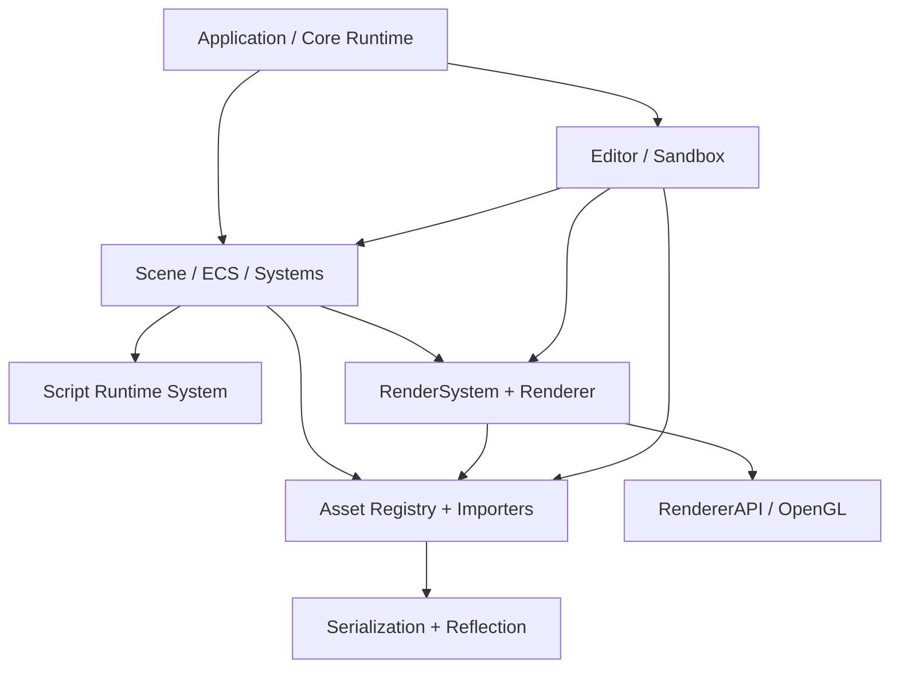

# 技术计划: engine-development-roadmap

> **状态**: approved
> **Spec 版本**: 1.0
> **创建日期**: 2026-03-25

> **职责说明**: 本文档专注于架构设计和技术决策，不包含具体的实施步骤、测试计划或上线流程。这些内容由 workflow-task 阶段负责。

---

## 1. 概述

本计划将 HuaEngine 的上层开发 roadmap 收束成一条明确的技术演进主线：先建立能支撑长期演进的基础能力底座，再围绕这套底座进入渲染强化阶段。基础阶段的核心不是“再补几个功能点”，而是形成四个稳定边界：统一运行时生命周期、统一场景与脚本调度、统一资产引用与持久化边界、统一渲染输入面。[foundation-capability-sequencing][script-runtime-integration]

从当前仓库事实看，Core、Scene、Serialization、Rendering、Editor 都已经有雏形，但资产管理仍未独立成清晰层次，脚本运行时尚未接通，渲染资源和序列化边界仍交织。因此，这份计划采取“基础闭环优先、渲染强化后置、工具链保持轻量”的路线。[foundation-capability-sequencing][rendering-evolution-path][lightweight-tooling-boundary]

---

## 2. 架构设计

### 2.1 架构视角说明

- 上下文（Context）: HuaEngine 作为引擎核心，向 Editor 与 Sandbox 提供运行时、场景、资源、渲染和验证能力。
- 容器（Container）: 运行时内核、Scene/ECS 域、Asset/Serialization 域、Rendering 域、Validation Surface（Editor/Sandbox）。
- 组件（Component）: `Application`、`Scene`、`System`、`ScriptRuntimeSystem`、`AssetRegistry`、`AssetImporters`、`SerializationManager`、`RenderSystem`、`Renderer`、`EditorLayer`。
- 部署（Deployment）: 单机本地开发环境；`Editor` 和 `Sandbox` 作为两个可执行宿主复用同一静态库引擎。

### 2.2 系统架构图

### 2.3 模块说明

| 模块 | 职责 | 依赖 | 关联需求 |
|------|------|------|----------|
| Core Runtime | 提供主循环、窗口、事件、Layer、日志与初始化入口 | - | FR-1, FR-3 |
| Scene Runtime | 提供 Entity、Scene、System 注册与统一更新主线 | Core Runtime | FR-2, FR-3 |
| Script Runtime | 将脚本实例生命周期纳入 Scene/System 调度 | Scene Runtime | FR-2, FR-4 |
| Asset Domain | 提供资产标识、注册、加载、运行时查找与引用边界 | Scene Runtime, Serialization | FR-2, FR-4 |
| Serialization Domain | 提供 JSON 为主的持久化通道和类型反射集成 | Asset Domain | FR-2, FR-4 |
| Rendering Domain | 消费 Scene 与 Asset 输入，输出当前与后续渲染能力 | Scene Runtime, Asset Domain | FR-6, FR-7 |
| Validation Surface | 用 Editor/Sandbox 验证和可视化基础能力及渲染能力 | Core Runtime, Scene Runtime, Rendering Domain | FR-5, FR-7 |

### 2.4 Roadmap 架构阶段

| 阶段 | 架构焦点 | 进入条件 | 输出边界 | 延后项边界 |
|------|----------|----------|----------|------------|
| Phase A: Runtime Base | 固化 Runtime、Scene、System 主线 | 已有单窗口、单 Scene 主循环可运行 | Scene、Serialization、Editor 可共享统一启动链 | 不要求此阶段完成统一资产标识、完整脚本调度或渲染能力增强 |
| Phase B: Foundation Closure | 建立 Asset/Serialization/Script 三者闭环 | Runtime Base 稳定 | 资产可被引用、保存、恢复；脚本可挂接并被调度 | 不要求此阶段完成高级渲染抽象、复杂编辑器工具链或跨平台扩张 |
| Phase C: Render-Ready | 让渲染输入面稳定、问题定位边界清晰 | Foundation Closure 达成 | Scene/Asset 到 RenderSystem 的输入可预测、可复现 | 不要求此阶段完成高阶图形特性、完整 RenderGraph 或重型内容工具链 |
| Phase D: Rendering Expansion | 强化渲染能力与更高层渲染抽象 | Render-Ready 达成 | 在不推翻前序边界的前提下扩张渲染能力 | 不在本计划中承诺音频、物理、网络等新系统同步推进 |

---

## 3. 技术选型

| 领域 | 选型 | 理由 | 备选方案 |
|------|------|------|----------|
| 引擎语言与构建 | 继续使用 C++17 + CMake + VS2022 工作流 | 与现有仓库一致，避免基础阶段被工具迁移打断 | 升级到更新标准或更换构建系统 |
| ECS / World | 保持 EnTT + `Scene/System` 外层封装 | 当前已有稳定主线，且足够支撑脚本和渲染接入 | 自建 ECS 或重写 Scene 框架 |
| 资产标识 | 引入统一 `AssetHandle + AssetRegistry` 作为资源边界 | 当前 Mesh/Material/Texture 依赖名字/路径约定，缺少统一标识层，会放大持久化与运行时耦合。[foundation-capability-sequencing][rendering-evolution-path] | 继续使用字符串路径 / 名称直连 |
| 持久化主格式 | 继续以 JSON 作为当前唯一权威作者格式 | 当前运行时只稳定接入 JSON backend，继续沿现有通路演进成本最低。[foundation-capability-sequencing] | 提前引入 YAML / Binary 双轨 |
| 脚本能力 | 先把原生 C++ 脚本继承接入 Scene 生命周期，再讨论更高层脚本方案 | 当前 `NativeScriptComponent` / `ScriptableEntity` 已存在，但未调度；先补闭环最符合仓库现状。[script-runtime-integration] | 直接引入更复杂脚本语言运行时 |
| 渲染主路径 | 继续以 `RenderSystem -> Renderer -> RendererAPI(OpenGL)` 为当前演进主轴 | 这是当前真实热路径；`RenderPipeline` 还不是主战场。[rendering-evolution-path] | 先重构成新的 RenderPipeline 框架 |
| 工具面 | 保持 Editor/Sandbox 作为轻量验证与演示面 | 用户已明确工具链当前不是主目标；现有 Editor 也更接近验证器。[lightweight-tooling-boundary] | 扩成重型内容生产工具链 |

---

## 4. 依赖分析

### 4.1 内部依赖

- Core Runtime → Scene Runtime
- Scene Runtime → Script Runtime
- Scene Runtime → Asset Domain
- Asset Domain → Serialization Domain
- Rendering Domain → Scene Runtime
- Rendering Domain → Asset Domain
- Validation Surface → Core Runtime / Scene Runtime / Rendering Domain / Asset Domain

### 4.2 外部依赖

| 包名 | 版本 | 用途 | 维护状态 |
|------|------|------|----------|
| EnTT | 仓库内集成版本 | ECS registry 与 view 查询 | 稳定 |
| GLFW | 仓库内集成版本 | 窗口与输入 | 稳定 |
| GLAD | 仓库内集成版本 | OpenGL 函数加载 | 稳定 |
| ImGui | 仓库内集成版本 | Editor / 调试 UI | 稳定 |
| GLM | 仓库内集成版本 | 数学类型与序列化特化 | 稳定 |
| spdlog | 仓库内集成版本 | 日志与 Editor Console 数据源 | 稳定 |

---

## 5. 风险评估

| 风险 | 可能性 | 影响 | 缓解策略 |
|------|--------|------|----------|
| 没有统一资产标识，导致 Scene/Material/Mesh 恢复路径继续脆弱 | 高 | 高 | 在基础阶段把 `AssetRegistry + AssetHandle` 作为硬边界 |
| 脚本运行时仍不接入 Scene 生命周期，导致“脚本继承”停留在表面接口 | 高 | 高 | 将脚本系统纳入基础阶段 gate，并要求与 Scene/Serialization 协同 |
| 过早扩张 Editor，吞掉底层建设资源 | 中 | 中 | 只保留验证、调试、演示功能，避免把 Editor 变成当前主战场 |
| 过早推进 RenderPipeline 级重构，与当前主路径脱节 | 中 | 高 | 渲染阶段先增强热路径，再在其上抽象 |
| JSON backend 能力边界被高估，导致复杂资源格式难以维护 | 中 | 中 | 在基础阶段把 JSON 用作权威作者格式，同时保持 backend 抽象层不失效 |

---

## 6. 安全与合规考虑

- 身份与访问控制: 当前是本地单机开发引擎，无用户认证需求；重点是限制内部模块职责边界，避免 Editor 直接绕过资源/场景边界读写底层状态。
- 数据保护: 资产与场景文件应优先采用受控相对路径和统一注册表引用，避免任意路径散落在 Scene/Material 中。
- 合规要求: 当前不涉及外部合规标准；更现实的要求是保证资产和序列化文件格式一致、可追踪、可恢复。

---

## 7. 可观测性策略

> **注意**: 此章节仅定义架构层面的可观测性策略，具体的实施步骤和工具配置由 workflow-task 负责。

- **指标设计**: 关注四类健康信号: 资源解析成功率、场景读写成功率、脚本生命周期触发完整性、渲染主路径可提交性。
- **日志策略**: 继续依赖 `Log` / `Editor Console` 作为统一观察面，并要求资产加载失败、序列化缺字段、脚本实例化失败、渲染资源缺失都有明确日志事件。
- **链路追踪**: 优先保证 `Asset -> Scene -> RenderSystem` 和 `Scene -> Script Runtime` 两条主链可定位，而不是一开始引入复杂 tracing 基础设施。
- **告警原则**: 在开发态以断言 + error/warn 日志为主；任何破坏基础闭环的错误都应在 Editor / Sandbox 中可见。

---

## 8. 架构决策记录 (ADR)

### ADR-001: 先完成基础闭环，再进入渲染强化

- **状态**: 已采纳
- **上下文**: spec 已明确要求基础能力优先、渲染后置。
- **决策**: 先建立 Runtime / Scene / Asset / Serialization / Script 的稳定闭环，之后再把主资源投向渲染增强。
- **后果**: 短期内渲染花样不会是主成果，但整体返工风险最低。
- **关联需求**: FR-2, FR-6, NFR-3

### ADR-002: 资产通过统一 Asset Registry 与 Handle 建边界

- **状态**: 已采纳
- **上下文**: 当前 Mesh、Material、Texture 的恢复仍较依赖名称和路径约定。
- **决策**: 用统一 Asset Registry/Handle 作为 Scene、Serialization、Rendering 之间的公共资源引用层。
- **后果**: 基础阶段需要先补资产边界，但后续资源类型扩展和渲染增强会更稳定。
- **关联需求**: FR-2, FR-4, NFR-4

### ADR-003: JSON 继续作为当前唯一权威作者格式

- **状态**: 已采纳
- **上下文**: 运行时真正稳定接入的只有 JSON backend。
- **决策**: 当前阶段继续围绕 JSON 完善场景与资产持久化，其他格式保留为未来扩展点。
- **后果**: 近期格式统一、调试成本低，但复杂数据兼容性要求不能高估。
- **关联需求**: FR-2, FR-3, NFR-3

### ADR-004: 脚本继承能力先接入 Scene 生命周期

- **状态**: 已采纳
- **上下文**: 脚本类型已存在，但当前没有统一调度。
- **决策**: 先实现原生脚本在 Scene/System 内的创建、更新、销毁与场景协同，再讨论更重的脚本方案。
- **后果**: 能尽快把“脚本继承”从声明变成可用能力，同时避免引入更大技术面。
- **关联需求**: FR-2, FR-4, NFR-4

### ADR-005: Editor / Sandbox 当前只承担验证面职责

- **状态**: 已采纳
- **上下文**: 用户明确不要求完整工具链；现有 Editor 也主要承担验证面角色。
- **决策**: 当前阶段只保留场景查看、基础属性编辑、调试与演示能力，不把工具完备度作为主目标。
- **后果**: 开发资源会更多集中在底层闭环，但工具体验增强会后置。
- **关联需求**: FR-5, FR-7, NFR-3

---

## 9. Roadmap Guidance

### 9.1 当前主阶段

当前应定位在 `Phase A -> Phase B` 过渡区：Runtime、Scene、Serialization、Rendering 都已有雏形，但基础闭环尚未成立，最关键的工作是把资源边界、脚本生命周期和场景持久化变成一致系统。

### 9.2 进入渲染强化前必须满足的上层 gate

- 资产可以通过统一引用机制被 Scene、Material、Mesh 稳定恢复和查找
- 序列化/反序列化不再只停留在“能存一点数据”，而是能稳定恢复基础运行态
- 脚本继承能力进入 Scene 生命周期，具备可挂接、可执行、可销毁的统一模型
- Editor/Sandbox 能清晰暴露基础能力结果，而不是把调试成本转嫁给底层代码阅读

### 9.3 渲染强化阶段的建议焦点

- 先增强当前热路径的稳定性、资源输入契约和可定位性
- 在现有 `RenderSystem -> Renderer -> OpenGL` 主链上扩能力，而不是立刻发起大规模渲染框架重构
- 待热路径和资源边界稳定后，再考虑更强的 RenderPipeline / Render Graph 抽象

---

### 9.4 各阶段的延后项边界

- Phase A 不承诺统一资产标识、脚本运行时闭环和渲染能力增强；这些属于后续阶段。
- Phase B 不承诺高阶渲染抽象、复杂编辑器工具链或多格式持久化并行支持；重点仍是基础闭环成立。
- Phase C 不承诺完整 RenderGraph、复杂后处理生态或内容生产级工具链；重点是让渲染输入稳定、边界清晰。
- Phase D 只承诺渲染能力扩张，不同时把音频、物理、网络等新系统纳入当前 roadmap 主线。

## 10. 调研引用索引

- [foundation-capability-sequencing](research/foundation-capability-sequencing/research.md)
- [script-runtime-integration](research/script-runtime-integration/research.md)
- [rendering-evolution-path](research/rendering-evolution-path/research.md)
- [lightweight-tooling-boundary](research/lightweight-tooling-boundary/research.md)

---

*Generated by workflow-plan | 2026-03-25*
