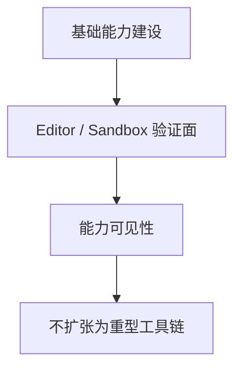

# 调研报告: lightweight-tooling-boundary

## SCOPE

- 调研目标: 明确当前阶段 Editor / Sandbox 的合理职责边界。
- 核心问题:
  - 当前 Editor 在系统中的角色是什么。
  - 为什么不应该在当前阶段投入重型工具链。
- 评估维度:
  - 是否服务基础能力验证
  - 是否会挤占核心能力建设资源
  - 是否保留未来演进空间

## GATHER

- Evidence: [E-1](evidence/evidence-1.md) [E-2](evidence/evidence-2.md)

## ANALYZE

| 观察项 | 现状 | 影响 |
|--------|------|------|
| Editor 定位 | 当前主要负责工作台和示例场景验证 | 适合继续作为轻量验证面 |
| 用户约束 | 不追求完整工具链 | 当前不应以工具完备性为主线 |

## COMPARE

| 方案 | 优点 | 问题 |
|------|------|------|
| 保持轻量验证面 | 与 spec 一致，成本可控，聚焦底座 | 功能看起来不“豪华” |
| 大幅扩展编辑器工具链 | 表面生产力更强 | 会稀释基础能力建设优先级 |

## RECOMMEND

推荐把 Editor 和 Sandbox 明确定位为基础能力的可视化验证面、调试面和演示面；只有在基础能力和渲染强化阶段稳定后，才讨论更完整的内容生产工具链。[E-1][E-2]

## Sources

- [E-1](evidence/evidence-1.md)
- [E-2](evidence/evidence-2.md)
