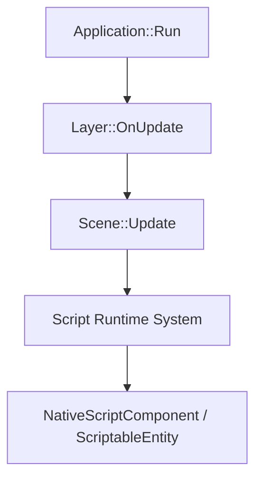

# 调研报告: script-runtime-integration

## SCOPE

- 调研目标: 明确脚本继承能力如何接入现有运行时主链，成为基础阶段的一部分。
- 核心问题:
  - 当前脚本能力缺失在哪个环节。
  - 应该依附哪条既有生命周期。
- 评估维度:
  - 是否最少破坏现有运行时结构
  - 是否支持后续序列化和编辑器联动

## GATHER

- Evidence: [E-1](evidence/evidence-1.md) [E-2](evidence/evidence-2.md)

## ANALYZE

| 观察项 | 现状 | 影响 |
|--------|------|------|
| 脚本接口 | 类型已存在 | 说明方向已被仓库接受 |
| 调度链路 | 当前缺失 | 脚本能力尚不可用 |
| 运行宿主 | Scene/System 与 Application 主循环已稳定 | 可以把脚本纳入既有更新链 |

## COMPARE

| 方案 | 优点 | 问题 |
|------|------|------|
| 脚本依附 Scene/System 调度 | 与现有结构一致，便于序列化和编辑器理解 | 需要先明确脚本系统职责 |
| 脚本直接挂在 Layer/Editor 里 | 实现可能更快 | 破坏场景运行时边界，不利于扩展 |

## RECOMMEND

推荐把脚本继承能力定义为 Scene 生命周期的一部分，由专门脚本系统统一驱动实例创建、更新和销毁，而不是放到 Editor 或某个 Layer 的临时逻辑中。[E-1][E-2]

## Sources

- [E-1](evidence/evidence-1.md)
- [E-2](evidence/evidence-2.md)
