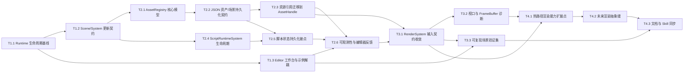

---
name: "engine-development-roadmap"
status: draft
version: 1.0.0
created_date: "2026-03-25"
plan_version: "1.0"
spec_version: "1.0"
parallel_config:
  max_concurrent: 5
  prefer_critical_path: true
  auto_schedule: true
---

# 任务列表: engine-development-roadmap

## 1. 任务总览

| 指标 | 值 |
|------|-----|
| 总任务数 | 15 |
| 关键路径长度 | 9 |
| 可并行任务组数 | 4 |
| 预估总时长 | 56h |

### 依赖关系图



---

## 2. 任务清单

### 阶段 1: Runtime Base

| ID | 任务 | 优先级 | 估时 | 依赖 | 标记 | 模块 | 状态 |
|----|------|--------|------|------|------|------|------|
| T1.1 | 固化 `Application -> Scene -> Layer` 生命周期基线 | P0 | 2h | - | [R] | Core Runtime | [ ] |
| T1.2 | 明确 `Scene/System` 更新契约与脚本挂接点 | P0 | 3h | T1.1 | [R] | Scene Runtime | [ ] |
| T1.3 | 将 `EditorLayer` 工作台壳与示例场景初始化解耦 | P1 | 3h | T1.1 | [P][R] | Validation Surface | [ ] |

### 阶段 2: Foundation Closure

| ID | 任务 | 优先级 | 估时 | 依赖 | 标记 | 模块 | 状态 |
|----|------|--------|------|------|------|------|------|
| T2.1 | 建立 `AssetHandle + AssetRegistry` 核心模型与查找接口 | P0 | 4h | T1.2 | [T][R] | Asset Domain | [ ] |
| T2.2 | 固化以 JSON 为权威格式的资产/场景持久化契约 | P0 | 4h | T2.1 | [T][R] | Serialization Domain | [ ] |
| T2.3 | 将 Mesh/Material/Texture 引用迁移到统一资产边界 | P0 | 6h | T2.2 | [T][R] | Asset Domain | [ ] |
| T2.4 | 实现 `ScriptRuntimeSystem` 的创建/更新/销毁生命周期 | P0 | 6h | T1.2 | [T][R] | Script Runtime | [ ] |
| T2.5 | 接入脚本状态持久化与 Scene 协同恢复 | P1 | 4h | T2.2, T2.4 | [T] | Script Runtime | [ ] |
| T2.6 | 打通资产/脚本错误在 Log 与 Editor Console 的反馈链 | P1 | 2h | T2.3, T2.5, T1.3 | [P] | Validation Surface | [ ] |

### 阶段 3: Render-Ready

| ID | 任务 | 优先级 | 估时 | 依赖 | 标记 | 模块 | 状态 |
|----|------|--------|------|------|------|------|------|
| T3.1 | 收敛 `RenderSystem` 的场景输入契约到资产边界之上 | P0 | 4h | T2.3, T2.6 | [T][R] | Rendering Domain | [ ] |
| T3.2 | 补齐 Camera / Viewport / FrameBuffer 的诊断与保护 | P1 | 3h | T3.1 | [P] | Rendering Domain | [ ] |
| T3.3 | 构建 Editor / Sandbox 的可复现渲染验证场景 | P1 | 3h | T3.1, T1.3 | [P][R] | Validation Surface | [ ] |

### 阶段 4: Rendering Expansion

| ID | 任务 | 优先级 | 估时 | 依赖 | 标记 | 模块 | 状态 |
|----|------|--------|------|------|------|------|------|
| T4.1 | 在当前热路径上预留材质/Shader 渲染能力扩展点 | P1 | 5h | T3.1, T3.2 | [R] | Rendering Domain | [ ] |
| T4.2 | 引入面向未来 `RenderPipeline` 的抽象缝而不替换热路径 | P2 | 5h | T4.1 | [R] | Rendering Domain | [ ] |
| T4.3 | 同步 roadmap gate、延后项与模块 Skill 文档 | P3 | 2h | T3.3, T4.2 | [P] | Validation Surface | [ ] |

---

## 3. 任务详情

### T1.1: 固化 `Application -> Scene -> Layer` 生命周期基线

- **模块**: core-runtime
- **优先级**: P0
- **估时**: 2h
- **依赖**: 无
- **标记**: [R]

**描述**:
梳理并固定运行主循环中 Application、Layer、Scene 更新的职责边界，明确哪些逻辑属于全局初始化、哪些属于每帧更新、哪些属于验证面附加逻辑，为后续脚本系统和资产系统接入建立稳定宿主。

**验收标准**:
1. 核心运行生命周期有明确单一入口和稳定调用顺序。
2. Scene 更新链与 Layer/Editor 附加逻辑的边界被明确记录并可被后续模块复用。

**关联需求**: FR-1, FR-3, NFR-3

---

### T1.2: 明确 `Scene/System` 更新契约与脚本挂接点

- **模块**: scene-runtime
- **优先级**: P0
- **估时**: 3h
- **依赖**: T1.1
- **标记**: [R]

**描述**:
围绕现有 `Scene::Update()`、`System` 注册顺序和生命周期语义，定义脚本系统、序列化恢复和渲染系统未来都可以依附的统一更新契约，避免逻辑散落在 Layer 或 Editor 中。

**验收标准**:
1. `Scene/System` 的执行边界和顺序被明确下来。
2. 脚本系统和渲染系统的挂接位置可直接从契约中推导。

**关联需求**: FR-2, FR-3, ADR-004

---

### T1.3: 将 `EditorLayer` 工作台壳与示例场景初始化解耦

- **模块**: validation-surface
- **优先级**: P1
- **估时**: 3h
- **依赖**: T1.1
- **标记**: [P][R]

**描述**:
把当前 Editor 中“工作台框架”和“示例渲染/场景搭建”两类职责拆开，让 Editor/Sandbox 成为可复用的验证面，而不是和某个 demo 场景强绑定。

**验收标准**:
1. 编辑器外壳与示例资源/场景初始化职责可分离切换。
2. 后续基础能力验证不再依赖单一 demo 逻辑耦合。

**关联需求**: FR-5, FR-7, ADR-005

---

### T2.1: 建立 `AssetHandle + AssetRegistry` 核心模型与查找接口

- **模块**: asset-domain
- **优先级**: P0
- **估时**: 4h
- **依赖**: T1.2
- **标记**: [T][R]

**描述**:
建立统一资产标识、注册、查找与生命周期边界，替代直接依赖路径和名称约定的临时方式，为 Mesh、Material、Texture 和后续资源类型提供统一引用层。

**验收标准**:
1. 资源引用可以通过统一 handle 和 registry 解析，而不是散落的名字/路径直连。
2. Scene、Serialization、Rendering 可以共享同一资产查找边界。
3. 关键接口具备基础测试覆盖。

**关联需求**: FR-2, FR-4, ADR-002

---

### T2.2: 固化以 JSON 为权威格式的资产/场景持久化契约

- **模块**: serialization-domain
- **优先级**: P0
- **估时**: 4h
- **依赖**: T2.1
- **标记**: [T][R]

**描述**:
围绕 JSON backend 明确资产、场景、组件和脚本运行状态的作者格式与读写边界，确保基础闭环建立在当前真实可用的持久化主通路之上。

**验收标准**:
1. 场景与资产的权威存储格式统一落在 JSON 通路上。
2. 资产引用、场景结构和扩展字段有一致读写约束。
3. 关键序列化契约具备回归测试覆盖。

**关联需求**: FR-2, FR-3, ADR-003

---

### T2.3: 将 Mesh/Material/Texture 引用迁移到统一资产边界

- **模块**: asset-domain
- **优先级**: P0
- **估时**: 6h
- **依赖**: T2.2
- **标记**: [T][R]

**描述**:
让渲染资源从“名称/路径偶然一致”的恢复方式迁移到明确的资产边界之上，保证 Scene、Material、Mesh 和运行时资源恢复使用同一套引用契约。

**验收标准**:
1. Mesh、Material、Texture 的核心引用方式统一到资产边界。
2. 渲染资源恢复不再依赖分散的路径约定。
3. 相关资源恢复路径具备基础验证用例。

**关联需求**: FR-2, FR-4, ADR-002

---

### T2.4: 实现 `ScriptRuntimeSystem` 的创建/更新/销毁生命周期

- **模块**: script-runtime
- **优先级**: P0
- **估时**: 6h
- **依赖**: T1.2
- **标记**: [T][R]

**描述**:
把 `NativeScriptComponent` / `ScriptableEntity` 接入 Scene 生命周期，使脚本从“声明存在”变成真正可挂接、可更新、可销毁的运行时能力。

**验收标准**:
1. 脚本实例在 Scene 生命周期内可被创建、更新和销毁。
2. 脚本调度不依赖 EditorLayer 或临时 Layer 逻辑。
3. 脚本生命周期具备基础测试覆盖。

**关联需求**: FR-2, ADR-004

---

### T2.5: 接入脚本状态持久化与 Scene 协同恢复

- **模块**: script-runtime
- **优先级**: P1
- **估时**: 4h
- **依赖**: T2.2, T2.4
- **标记**: [T]

**描述**:
补齐脚本与 Scene/Serialization 的连接点，使场景恢复时能同时恢复脚本挂接关系和必要状态，避免脚本生命周期与存档系统脱节。

**验收标准**:
1. 脚本挂接信息能进入场景持久化链路。
2. 场景恢复后脚本运行状态能够按统一契约重建。
3. 关键序列化恢复路径具备验证用例。

**关联需求**: FR-2, FR-3, ADR-004

---

### T2.6: 打通资产/脚本错误在 Log 与 Editor Console 的反馈链

- **模块**: validation-surface
- **优先级**: P1
- **估时**: 2h
- **依赖**: T2.3, T2.5, T1.3
- **标记**: [P]

**描述**:
把资产解析失败、脚本实例化失败、场景恢复缺口等基础能力错误统一暴露到日志和 Editor Console 中，让验证面能真正承担问题定位职责。

**验收标准**:
1. 关键基础闭环失败路径能在日志或 Editor Console 中被直接看到。
2. Editor/Sandbox 对基础能力结果的可见性明显提升。

**关联需求**: FR-5, FR-7, 可观测性策略

---

### T3.1: 收敛 `RenderSystem` 的场景输入契约到资产边界之上

- **模块**: rendering-domain
- **优先级**: P0
- **估时**: 4h
- **依赖**: T2.3, T2.6
- **标记**: [T][R]

**描述**:
让渲染主路径消费稳定的 Scene/Asset 输入，而不是同时处理资源恢复、缺失资源和绘制逻辑，从而把渲染问题和资产问题真正分层。

**验收标准**:
1. `RenderSystem` 的输入契约可明确区分“资源已就绪”和“资源恢复失败”。
2. 渲染主路径建立在稳定资产边界之上。
3. 关键输入路径具备基础验证用例。

**关联需求**: FR-6, FR-7, ADR-001

---

### T3.2: 补齐 Camera / Viewport / FrameBuffer 的诊断与保护

- **模块**: rendering-domain
- **优先级**: P1
- **估时**: 3h
- **依赖**: T3.1
- **标记**: [P]

**描述**:
围绕当前渲染热路径中最容易出现的视口、尺寸和 FrameBuffer 问题补上诊断和保护，降低 Render-Ready 阶段的问题定位成本。

**验收标准**:
1. 关键视口和 FrameBuffer 异常具备明确诊断信号。
2. 渲染路径中的常见尺寸/绑定错误不再默默失败。

**关联需求**: FR-6, 可观测性策略

---

### T3.3: 构建 Editor / Sandbox 的可复现渲染验证场景

- **模块**: validation-surface
- **优先级**: P1
- **估时**: 3h
- **依赖**: T3.1, T1.3
- **标记**: [P][R]

**描述**:
在轻量验证面中提供可重复使用的场景与资源组合，用来快速判断资产闭环、脚本接入和渲染主路径是否同时成立。

**验收标准**:
1. Editor / Sandbox 都能载入一组稳定的基础验证场景。
2. 基础闭环与渲染输入问题可以通过验证场景快速复现。

**关联需求**: FR-5, FR-6, ADR-005

---

### T4.1: 在当前热路径上预留材质/Shader 渲染能力扩展点

- **模块**: rendering-domain
- **优先级**: P1
- **估时**: 5h
- **依赖**: T3.1, T3.2
- **标记**: [R]

**描述**:
基于已稳定的热路径，为后续更强的材质、Shader 和渲染能力增强预留扩展点，但不在当前阶段把整个渲染框架推翻重做。

**验收标准**:
1. 热路径具备明确的能力扩展切入点。
2. 新扩展点不会破坏既有 Render-Ready 输入契约。

**关联需求**: FR-6, ADR-001

---

### T4.2: 引入面向未来 `RenderPipeline` 的抽象缝而不替换热路径

- **模块**: rendering-domain
- **优先级**: P2
- **估时**: 5h
- **依赖**: T4.1
- **标记**: [R]

**描述**:
在不替换当前 `RenderSystem -> Renderer -> OpenGL` 热路径的前提下，为未来更强抽象预留清晰缝隙，避免提前发起大规模渲染重构。

**验收标准**:
1. 未来 `RenderPipeline` 或更高层抽象有明确接入缝隙。
2. 当前热路径仍保持可用和可定位，不被提前替换。

**关联需求**: FR-6, FR-7, ADR-001

---

### T4.3: 同步 roadmap gate、延后项与模块 Skill 文档

- **模块**: validation-surface
- **优先级**: P3
- **估时**: 2h
- **依赖**: T3.3, T4.2
- **标记**: [P]

**描述**:
把 roadmap 的阶段 gate、延后项边界以及关键模块约束同步回项目文档和 Skill，确保后续实现阶段不会偏离已经批准的上层规划。

**验收标准**:
1. 关键阶段 gate 和延后项边界已同步到可见文档。
2. 后续模块开发可以直接引用这些约束而不需要重新解释。

**关联需求**: FR-1, FR-3, FR-7

---

## 4. 关键路径

```
T1.1 -> T1.2 -> T2.1 -> T2.2 -> T2.3 -> T2.6 -> T3.1 -> T4.1 -> T4.2
```

**关键路径说明**:
- 关键路径上的任务决定基础闭环到渲染扩展的最短完成时间。
- 其中 `T2.1/T2.2/T2.3` 与 `T2.4/T2.5` 共同构成基础阶段的核心闭环，但资产链是更硬的阻塞路径。
- 应优先保证关键路径上的 P0/P1 任务获得资源。

---

## 5. 并行任务组

| 组 ID | 任务 | 前置依赖 | 说明 |
|-------|------|----------|------|
| G1 | T1.3 | T1.1 | Editor 工作台解耦可与 Scene 契约工作并行 |
| G2 | T2.4 | T1.2 | 脚本生命周期可与资产边界建设并行推进 |
| G3 | T3.2, T3.3 | T3.1, T1.3 | Render-Ready 阶段的诊断与验证场景在依赖满足后可并行 |
| G4 | T4.3 | T3.3, T4.2 | 文档与 Skill 同步在能力边界稳定后并行完成 |

---

## 6. 粒度警告

| 任务 | 问题 | 建议 |
|------|------|------|
| 无 | 当前任务估时均在 2h-6h 范围内 | 保持现有粒度，进入执行阶段 |

---

## 7. 任务标记说明

| 标记 | 含义 | 执行策略 |
|------|------|----------|
| `[T]` | 测试先行（TDD） | 先写测试用例，再实现功能 |
| `[P]` | 可并行 | 可与同组 [P] 任务并行执行 |
| `[R]` | 需审查 | 完成后需要人工代码审查 |

---

## 8. 优先级说明

| 优先级 | 含义 | 分配条件 |
|--------|------|----------|
| P0 | 最高优先级 | 关键路径上的阻塞任务 |
| P1 | 高优先级 | 核心业务逻辑任务 |
| P2 | 中优先级 | 辅助功能任务 |
| P3 | 低优先级 | 优化和文档任务 |

---

*Generated by workflow-task | 2026-03-25*
