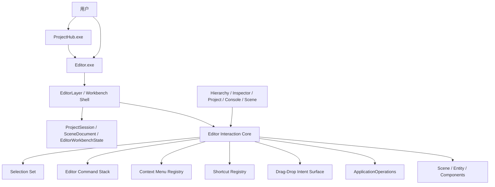

# 技术计划：engine-editor-capability-expansion

> **状态**：approved
> **Spec 版本**：1.0.0
> **创建日期**：2026-03-28

> **职责说明**：本计划只定义架构设计、技术决策与风险控制，不拆解实现任务、不编写测试用例、不制定上线步骤。

---

## 1. 概述

当前 HuaEngine 已经具备项目工作台闭环，但编辑器交互层仍然偏轻量，核心问题不在“缺几个按钮”，而在于缺少一套足以承载常用编辑行为的基础交互骨架。  
本计划的目标是：在不打破现有 `ProjectHub -> Editor -> ProjectSession / SceneDocument / ApplicationOperations` 方向的前提下，为编辑器补齐第一阶段基础交互能力，并建立未来高级编辑器能力可持续扩展的结构基础。[interaction-command-spine][selection-and-batch-edit][context-input-extension]

本阶段重点不是“做完整高级工具链”，而是把编辑器推进到一个更像正式引擎编辑器的基础态：

- 有统一交互命令骨架
- 有可扩展的右键菜单 / 快捷键 / 拖拽入口
- 有单选 / 多选与批量动作基础
- 有首批高频对象编辑功能落在 `Hierarchy / Inspector`

---

## 2. 架构设计

### 2.1 架构视图

- 上下文：本地桌面型引擎编辑器
- 容器：`ProjectHub.exe`、`Editor.exe`、HuaEngine runtime / scene / rendering / serialization surfaces
- 组件：工作台状态层、编辑器交互核心层、面板交互层、正式领域操作层
- 部署：保持 `Editor.exe` 为主要项目工作台宿主，不新增新的 GUI 产品宿主

### 2.2 系统架构图

### 2.3 模块分层

| 层 | 责任 | 当前状态 | 本阶段变化 |
|----|------|----------|------------|
| 工作台状态层 | 项目、场景、摘要、诊断 | 已有 | 继续作为统一状态面 |
| 编辑器交互核心层 | 命令、选择、上下文菜单、快捷键、拖拽 | 缺失 | 新增 |
| 面板交互层 | Hierarchy / Inspector 等具体 UI | 已有但偏轻量 | 改为消费交互核心层 |
| 正式领域操作层 | Project / Scene / Asset / Script / Validation | 已有 | 保持边界，不直接承载 UI 交互模型 |

### 2.4 关键设计决策

#### A. 在 Editor 内建立专门的交互核心层

不把 `Undo/Redo`、右键菜单、快捷键、多选和拖拽散落到各面板中，也不把它们塞进 `ApplicationOperations`。  
本阶段新增一层 Editor 内部交互核心层，作为 GUI 交互能力的唯一归口。[interaction-command-spine]

#### B. 选择模型升级为“选择集合”

当前 `Selection` 单选模型升级为集合型模型：

- 单选 = 集合大小为 `1`
- 多选 = 集合大小大于 `1`
- 空选择 = 空集合

这样可直接支撑：

- `Hierarchy` 多选
- 批量删除
- Inspector 多选摘要模式

而不必一开始就做完整多对象联合属性编辑。[selection-and-batch-edit]

#### C. 首批交互能力必须接入统一命令栈

以下首批功能都应接入统一命令骨架，而不是纯 UI 直连：

- 新建实体
- 删除选中实体
- 添加组件
- 删除组件

因为这些动作天然关联：

- dirty state
- undo/redo
- 快捷键
- 右键菜单触发

#### D. 上下文菜单、快捷键、拖拽采用轻量注册式接入

本阶段不做重型编辑器插件框架，但必须建立轻量注册式接入面：

- `Context Menu Registry`
- `Shortcut Registry`
- `Drag-Drop Intent Surface`

这样未来新增面板和动作时，不需要重写整个工作台交互结构。[context-input-extension]

### 2.5 运行时交互流

#### Flow 1：Hierarchy 右键新建实体

1. 用户在 `Hierarchy` 中打开上下文菜单
2. 面板向交互核心请求当前上下文动作
3. 用户触发“新建实体”
4. 交互核心执行编辑器命令
5. 命令修改当前 `SceneDocument`
6. 工作台状态刷新并标记 dirty

#### Flow 2：多选删除实体

1. 用户在 `Hierarchy` 中形成选择集合
2. 用户通过右键菜单或快捷键触发删除
3. 交互核心将选择集合转化为批量删除命令
4. 删除结果更新场景、选择状态和工作台反馈
5. 命令进入可撤销历史栈

#### Flow 3：Inspector 添加 / 删除组件

1. 用户在 `Inspector` 中打开对象上下文菜单
2. 菜单根据当前选中对象和组件情况暴露动作
3. 用户触发“添加组件”或“删除组件”
4. 交互核心执行对应命令
5. `SceneDocument` dirty、摘要刷新、诊断与日志反馈更新

### 2.6 本阶段范围边界

本阶段必须完成：

- Editor 交互核心层雏形
- 统一命令栈与基础 `Undo/Redo`
- 选择集合模型
- `Hierarchy / Inspector` 的右键菜单归口
- 内置快捷键接入与可扩展注册面
- 基础拖拽接入面
- 首批高频功能：新建实体、删除选中实体、添加组件、删除组件

本阶段明确延后：

- 完整高级资产浏览器
- 复杂多对象联合编辑
- 高级拖拽生态
- 大规模用户级快捷键编辑 UI
- 完整插件式工具扩展系统

---

## 3. 技术选型

| 区域 | 选择 | 理由 | 备选 |
|------|------|------|------|
| 交互命令层 | Editor 内部命令骨架 | 与领域层解耦，天然承载撤销重做 | 面板直写逻辑 |
| 选择模型 | 集合型选择状态 | 单选 / 多选统一表达 | 继续单选静态状态 |
| 上下文菜单 | 轻量注册式上下文动作表 | 支撑不同面板与未来扩展 | 每个面板硬编码 |
| 快捷键体系 | 内置绑定 + 注册入口 | 先满足基础能力，再给未来自定义留口 | 一次性做重型快捷键编辑器 |
| 拖拽 | 交互意图面 | 先把语义层搭起来 | 各面板私有拖拽实现 |

---

## 4. 依赖分析

### 4.1 内部依赖

- 编辑器交互核心层 -> `EditorWorkbenchState`
- 编辑器交互核心层 -> `SceneDocument`
- 编辑器交互核心层 -> `Selection` 升级后的选择集合
- 编辑器交互核心层 -> `ApplicationOperations`
- `HierarchyPanel` / `InspectorPanel` -> 编辑器交互核心层

### 4.2 外部依赖

| 依赖 | 用途 | 状态 |
|------|------|------|
| ImGui | 菜单、快捷键、右键菜单、拖拽交互 | 现有稳定依赖 |
| EnTT / ECS 封装 | 实体与组件操作 | 现有稳定依赖 |
| 当前工作台状态模型 | 项目、场景、dirty、诊断摘要 | 已存在 |

---

## 5. 风险评估

| 风险 | 概率 | 影响 | 缓解 |
|------|------|------|------|
| 交互能力继续散落到面板，导致后续难维护 | 高 | 高 | 明确引入 Editor 交互核心层，禁止首批功能直接写死在面板里 |
| 多选改造破坏现有 Inspector 单选工作流 | 中 | 高 | 采用集合模型，Inspector 先做单选完整、多选退化摘要 |
| 撤销重做边界不清，导致 dirty 状态混乱 | 中 | 高 | 把首批高频动作全部接入命令栈，统一控制 dirty 与历史 |
| 快捷键与上下文菜单冲突、重复注册 | 中 | 中 | 统一通过注册表归口，命令标识成为唯一绑定键 |
| 拖拽过早做复杂行为导致范围膨胀 | 中 | 中 | 本阶段只做基础拖拽接入面和少量必要动作，不追求完整生态 |

---

## 6. 安全与一致性考虑

- 本阶段主要是本地桌面编辑器交互能力增强，不涉及额外权限模型
- 编辑器交互层不得绕开正式项目 / 场景上下文
- 任何修改项目内容的 UI 动作，都必须保持工作台状态、dirty 状态和反馈语义一致

---

## 7. 可观测性策略

- 所有首批交互命令都应产生统一的工作台反馈结果
- 失败、拒绝执行、需人工处理等状态应继续进入 `Console` 的诊断面
- 可撤销命令的执行与回滚应在日志和工作台摘要中可追踪

---

## 8. 架构决策记录

### ADR-001：在 Editor 内新增交互核心层

- **状态**：accepted
- **背景**：当前编辑器已有领域操作面，但缺少 GUI 自身交互骨架。
- **决策**：新增 Editor 内部交互核心层，统一承载命令、快捷键、上下文菜单、拖拽和选择协同。
- **结果**：当前阶段结构更清晰，后续功能接入成本更低。
- **关联需求**：FR-5, FR-6, FR-7, FR-10, FR-11

### ADR-002：选择模型升级为集合，而不是继续维持单选静态模型

- **状态**：accepted
- **背景**：规范已要求多选与批量删除进入基础能力集合。
- **决策**：将单选视为选择集合的特例，并让多选成为正式能力。
- **结果**：可支撑多选删除和后续批量动作，但 Inspector 需要区分单选与多选模式。
- **关联需求**：FR-8, FR-10

### ADR-003：首批高频编辑动作必须进入统一命令栈

- **状态**：accepted
- **背景**：新建实体、删除实体、添加组件、删除组件都关联 dirty、日志和撤销重做。
- **决策**：首批高频对象编辑动作统一走命令栈，不允许继续做成纯局部 UI 操作。
- **结果**：本阶段改动面略大，但后续 `Undo/Redo` 和快捷键才能成立。
- **关联需求**：FR-5, FR-10, FR-11

### ADR-004：上下文菜单、快捷键、拖拽采用轻量注册式接入

- **状态**：accepted
- **背景**：规范要求当前阶段就为未来扩展预留空间。
- **决策**：先建立轻量注册面，而不是一次做重型插件系统，也不是继续散写硬编码逻辑。
- **结果**：首批功能可快速落地，同时保留未来扩展余地。
- **关联需求**：FR-6, FR-7, FR-9, FR-12

---

## 9. 规划结论

这条能力线的关键，不是继续在当前 Editor 上零散补功能，而是补出一个可以承载后续编辑器成长的基础交互骨架。  
本阶段的正确方向是：

- 先立交互核心层
- 再升级选择模型
- 再把 `Hierarchy / Inspector` 的首批高频动作接进去

这样 HuaEngine 编辑器就能从“有基础工作台”进一步推进到“有基础编辑器交互体系”，并且后面继续加能力时不需要再推倒重来。[interaction-command-spine][selection-and-batch-edit][context-input-extension]

---

## 10. 调研引用

- [interaction-command-spine](research/interaction-command-spine/research.md)
- [selection-and-batch-edit](research/selection-and-batch-edit/research.md)
- [context-input-extension](research/context-input-extension/research.md)

*Generated by workflow-plan | 2026-03-28*
