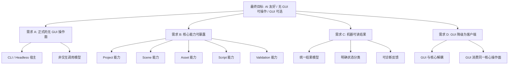
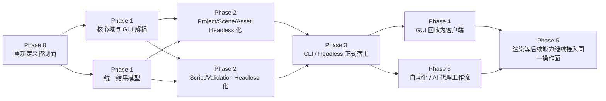
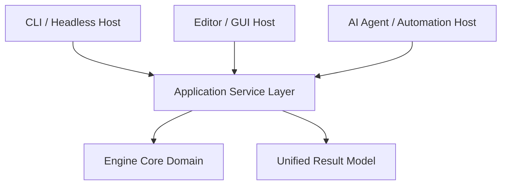

# HuaEngine AI 友好 / 无 GUI 操作化蓝图

> 日期: 2026-03-25
> 作者: Codex
> 状态: 草稿
> 目的: 用一份文档同时回答“目标是什么、需求是什么、该做什么、先做什么、以及大致怎么做”。

---

## 0. 这份文档解决什么问题

这不是一份实现任务清单，也不是一份纯愿景口号文档。

它的目的只有一个：把你对 HuaEngine 的新目标整理成一张可以长期指导开发的蓝图，让你能持续回答下面 5 个问题：

1. 我真正想把这个引擎做成什么样。
2. 为了达到这个目标，我真实需要的能力是什么。
3. 哪些能力必须先做，哪些能力应该后做。
4. 这些能力之间是什么依赖关系。
5. 如果开始落地，整体上应该怎么组织实现。

---

## 1. 目标、需求与能力

### 1.1 最终目标

你希望 HuaEngine 不只是“有一个 Editor 的图形引擎”，而是一个：

- **AI 友好** 的引擎
- **CLI-first / headless-first** 的引擎
- **GUI 可选** 的引擎
- **可自动化、可组合、可脚本化** 的引擎

换句话说，理想中的 HuaEngine 不应该把核心能力锁在 GUI 里，而应该像 `git`、`p4` 一样，具备一个稳定的命令式操作面。GUI 可以存在，但它应该只是客户端，而不是唯一入口。

### 1.2 从目标推导出的核心需求

为了达到这个目标，需求会自然分成 4 层。

#### 需求层 A: 操作面需求

你需要一个不依赖 GUI 的正式操作面，让用户、脚本、AI 代理、CI 都能调用它。

这意味着：
- 核心操作必须可以在终端或非交互环境中触发
- 调用过程不能依赖窗口焦点、鼠标点击或 GUI 状态
- GUI 不再是操作前提，而只是可选表现层

#### 需求层 B: 能力暴露需求

仅仅“能启动一个 headless 进程”还不够。你真正需要的是：当前重点能力必须被暴露成无 GUI 能力。

当前最小覆盖范围应当是：
- `Project`：项目初始化、项目上下文识别、项目状态检查
- `Scene`：场景创建、读取、修改、保存、验证
- `Asset`：资产登记、查询、校验、处理触发
- `Script`：脚本挂接、脚本状态检查、脚本相关验证
- `Validation`：能力检查、结果验证、失败定位

#### 需求层 C: 结果反馈需求

AI 友好不等于“能调用”，而是“调用结果可继续消费”。

这意味着：
- 每次调用都必须有稳定的结果边界
- 调用方至少能判断 `成功 / 失败 / 需人工介入`
- 结果中必须有足够的上下文，支持继续决策
- 错误信息不能只适合人看，也必须适合自动化链路消费

#### 需求层 D: 架构定位需求

你需要重新定义 GUI 的地位。

新的定位应该是：
- 引擎核心能力存在于核心域
- CLI / headless 是正式宿主
- GUI 是构建在同一核心域之上的一个客户端
- 后续所有能力都优先思考“如何无 GUI 使用”，再思考“如何在 GUI 中表现”

### 1.3 为了完成这些需求，引擎必须具备哪些能力

下面这张图不是实现图，而是**目标 -> 需求 -> 能力** 的全景映射。



### 1.3 能力边界定义

为了避免后续规划时对能力范围理解漂移，这里先把 5 个最小覆盖主题的边界钉死。

| 能力主题 | 包含什么 | 当前不包含什么 |
|----------|----------|----------------|
| Project | 项目初始化、项目识别、项目上下文切换、项目状态检查 | 团队协作平台、远程仓库工作流、发布平台管理 |
| Scene | 场景创建、读取、修改、保存、结构校验 | 复杂可视化编辑器交互、纯 GUI 专属拖拽编辑 |
| Asset | 资产登记、资产查询、资产校验、处理触发、引用一致性检查 | 完整 DCC 流程、重型资产管线平台 |
| Script | 脚本挂接关系、脚本状态检查、脚本相关验证、脚本运行上下文确认 | 立即扩展到复杂多语言脚本生态 |
| Validation | 针对当前重点能力的检查、诊断结果、状态判断、继续/中止依据 | 全量测试平台、完整发布验收系统 |

这些定义的意义是：后续只要某项能力仍然必须回到 GUI 才能完成，就说明它还没有真正进入这 5 类主题的正式支持范围。
### 1.4 当前引擎与目标之间的关键差距

结合你当前仓库的状态，这些差距是最核心的：

- 当前很多操作仍然是 `EditorLayer` / 面板 / demo scene 驱动，而不是正式操作面驱动。
- `Scene`、`Asset`、`Script`、`Validation` 这些能力虽然有骨架，但还没有统一的“无 GUI 入口”。
- 结果反馈还主要偏向日志、GUI 面板、运行时观察，而不是明确的机器可消费结果。
- GUI 仍然承担了太多“能力存在入口”的角色，而不是纯消费端角色。

结论很直接：

> 你现在缺的不是“再做几个工具窗口”，而是**重新定义引擎的控制面**。

---

## 2. 全景路线图

### 2.1 总体开发原则

如果把这个目标做成长期路线图，必须遵守 4 条原则：

- **先解耦，再暴露，再增强**
- **先建立 headless 主路径，再回头统一 GUI**
- **先让能力可调用，再让调用足够优雅**
- **先保证机器可消费，再考虑人类体验优化**

### 2.2 全景路线图总图

下面这张图表达的是“能力建设顺序”和“优先级关系”，不是任务列表。



### 2.3 阶段解释

#### Phase 0: 重新定义控制面

这是认知阶段，不是实现阶段。

你要先统一一件事：

> 核心能力必须先有无 GUI 路径，GUI 只能消费核心能力，不能再拥有核心能力。

如果这一步不统一，后面会不断回到 GUI-first 的惯性里。

优先级：`P0`

#### Phase 1: 核心域与 GUI 解耦

这一阶段的重点不是新命令，而是把能力从 GUI 身上剥下来。

目标：
- 让 Project / Scene / Asset / Script / Validation 的“核心动作”不依赖 Editor 面板存在
- 让 GUI 从“能力入口”变成“能力消费方”
- 建立统一的结果模型

优先级：`P0`

#### Phase 2: 重点能力 Headless 化

这一阶段是最关键的能力建设阶段。

目标：
- Project、Scene、Asset 先 headless 化
- Script、Validation 跟进进入同一工作流
- 形成最小可用的非 GUI 能力面

优先级：`P0`

#### Phase 3: 正式操作面成立

这一阶段才真正形成“像 git / p4 一样”的使用体验雏形。

目标：
- 提供正式 CLI / headless 宿主
- 让 AI 代理和自动化脚本可以稳定调用
- 让结果反馈具备自动决策价值

优先级：`P1`

#### Phase 4: GUI 回收为客户端

此时 GUI 的工作不是拥有能力，而是消费能力。

目标：
- GUI 与 headless 操作面保持结果一致
- Editor 继续提供可视化体验，但不再控制核心能力存在与否

优先级：`P1`

#### Phase 5: 让更多能力进入同一操作面

当前重点完成后，渲染、后续资源系统、更多验证能力都可以继续接入同一控制面。

优先级：`P2`

### 2.4 开发优先级地图

| 优先级 | 能力主题 | 为什么优先 |
|--------|----------|------------|
| P0 | 核心域与 GUI 解耦 | 不先解耦，所有后续 headless 化都会是假象 |
| P0 | Project / Scene / Asset / Script / Validation 最小覆盖面 | 这是无 GUI 能力的最小正式支持集合 |
| P0 | 统一结果模型 | 没有统一结果，AI 友好只是口号 |
| P1 | 正式 CLI / Headless 宿主 | 能力先建立，再给稳定入口 |
| P1 | GUI 消费同一能力面 | 用来防止回退到 GUI-first |
| P2 | 更广泛子系统继续接入 | 建立在核心模型已稳定的基础上 |

### 2.5 开发路线建议

你后续的开发顺序，建议始终遵守这条主线：

```text
先定义能力边界
-> 再把能力从 GUI 中剥离
-> 再建立 headless 调用面
-> 再统一输出结果
-> 再让 GUI 回来消费同一能力
-> 最后继续扩更多能力域
```

如果顺序反过来，比如先做一个 CLI 壳再说，最终很容易得到一个“表面上能调用，但实质上仍然依赖 GUI 逻辑”的伪 headless 系统。

---

### 2.6 阶段完成判据

为了让路线图不只是方向图，还能指导后续规划，这里补一层阶段完成判据。

| 阶段 | 完成标志 |
|------|----------|
| Phase 0 | 团队对“GUI 是客户端、headless 是正式操作面”这一定位达成一致，后续设计不再以 GUI 作为默认入口 |
| Phase 1 | 至少已有一批核心能力被识别为可从 GUI 中抽离，且统一结果模型已被确定为正式约束 |
| Phase 2 | `Project / Scene / Asset / Script / Validation` 五类能力都已定义出无 GUI 路径和结果边界 |
| Phase 3 | 已形成正式 CLI / headless 宿主，AI 代理和自动化脚本可以稳定调用最小闭环能力 |
| Phase 4 | GUI 开始消费同一操作面，且与无 GUI 路径在结果口径上保持一致 |
| Phase 5 | 新增能力继续沿同一控制面接入，而不是重新回到 GUI-first 分叉 |

这些判据不是实施验收标准，但它们足以作为后续 `plan` 和 `task` 阶段的阶段输入/输出约束。
## 3. 实现相关建议

这一部分开始回答“怎么做”，但仍然保持在架构和技术选型层，不进入具体编码任务。

### 3.1 推荐的总体架构思路

推荐采用 **核心域 + 应用服务层 + 多宿主客户端** 的结构。



这个架构的含义是：

- **Core Domain**：真正的 Project / Scene / Asset / Script / Validation 能力
- **Application Service Layer**：把核心能力包装成稳定操作语义
- **Result Model**：统一成功/失败/需人工介入的结果边界
- **CLI / GUI / Agent**：都只是宿主，消费同一套能力

### 3.2 为什么这是合适的架构

因为你现在最大的风险不是“功能不会写”，而是：

- 把 CLI 写成 Editor 的旁路接口
- 把 headless 调用写成一堆 GUI 逻辑的变体
- 把 AI 操作面写成日志堆叠，而不是正式结果模型

上面这套结构正好是为了解决这 3 个问题。

### 3.3 建议的能力分层

#### 层 1: Core Domain

这里放真正的领域能力：
- Project domain
- Scene domain
- Asset domain
- Script domain
- Validation domain

要求：
- 不依赖 GUI
- 不依赖具体终端交互
- 不假设调用方是人类

#### 层 2: Operation / Application Layer

这里负责把领域能力组织成“操作”。

例如：
- 打开项目上下文
- 创建场景
- 查询资产
- 触发脚本验证
- 执行验证检查

要求：
- 输入语义稳定
- 输出语义稳定
- 能被 CLI、GUI、AI 代理共同复用

#### 层 3: Host Layer

这里才是具体宿主：
- CLI 宿主
- GUI 宿主
- Agent / Automation 宿主

要求：
- 不拥有核心能力
- 只负责接收输入、调用应用层、展示结果

### 3.4 关键架构设计点

#### 设计点 A: GUI 必须从“能力拥有者”变成“能力调用者”

这是整个转型的核心。

如果某个能力只能通过 EditorLayer 或某个面板驱动，那这个能力就不算真正 headless-ready。

#### 设计点 B: 结果模型必须先于 CLI 体验被定义

很多系统失败，是因为它们先做命令，再补结果语义。

更稳的顺序应该是：
- 先定义统一结果分类
- 再定义结果最小信息集
- 再让 CLI / GUI / Agent 去消费它

#### 设计点 C: Validation 必须是第一等能力，而不是附属测试工具

因为你要的是 AI 友好化。

AI 代理如果无法判断“当前状态是否可继续”，整个自动化链就断了。所以 Validation 不应只是测试附属物，而应是核心操作面的一部分。

### 3.5 技术选型建议

下面不是唯一答案，而是按你当前仓库现状最稳的一条路。

| 主题 | 建议方向 | 原因 |
|------|----------|------|
| 核心实现语言 | 升级到 C++20 | 有迁移成本，但考虑到引擎本身还很初级，即使完全推到重来成本也不大 |
| 项目组织 | 保持 `HuaEngine` 核心库，新增 headless/CLI 宿主 | 避免把操作面塞回 Editor |
| 数据主格式 | 继续围绕 JSON 作为当前权威作者格式 | 现有序列化链已经最接近可复用状态 |
| 场景/资产能力入口 | 优先围绕现有 Scene / Serialization / Material / Mesh 链路抽象 | 当前已有受控数据对象和持久化基础 |
| 结果表示 | 推荐统一结构化结果对象 | 这是 AI 友好和 CLI 一致性的基础 |
| GUI 定位 | Editor 继续存在，但改成消费统一操作层 | 避免双套逻辑分裂 |

### 3.6 技术路线上的关键取舍

#### 取舍 1: 先做能力抽象，还是先做 CLI 壳

推荐：**先做能力抽象**。

原因：
CLI 壳很容易做，但如果底层能力仍然是 GUI 耦合的，最后只会得到一层薄薄的包装，而不是正式控制面。

#### 取舍 2: 先覆盖所有系统，还是先覆盖最小闭环

推荐：**先覆盖最小闭环**。

也就是：
- Project
- Scene
- Asset
- Script
- Validation

原因：
这 5 类能力已经足够构成“正式 headless 能力面”的第一版闭环。

#### 取舍 3: 先追求用户体验，还是先追求机器可消费

推荐：**先追求机器可消费**。

因为你这次的目标首先是 AI 友好化，而不是终端体验美化。可读性可以后面优化，但语义稳定必须先成立。

### 3.7 你后续在实现层应该重点检查什么

后续如果真的进入实现阶段，我建议你持续用下面这 6 个问题审视每一个能力：

1. 这个能力是不是必须经过 GUI 才能执行？
2. 这个能力有没有稳定的无 GUI 调用路径？
3. 这个能力的结果是否适合机器消费？
4. GUI 是否只是消费这个能力，而不是拥有它？
5. AI 代理能不能依据这次结果继续做下一步？
6. 这个能力未来接入更多子系统时，会不会再次回到 GUI-first？

如果其中任意一项回答为“不能”，说明这个能力还没有真正完成 headless / AI-friendly 化。

---

## 4. 最后的结论

把这件事说到底，你现在要做的不是“给引擎加一个命令行工具”。

你真正要做的是：

> 把 HuaEngine 从“GUI 驱动的引擎”重新定义为“核心能力可被程序化驱动的引擎”，然后让 GUI 成为这个引擎的一个客户端。

所以后续所有规划，都应该围绕这条主线展开：

- **目标**：AI 友好、无 GUI 可操作、GUI 可选
- **需求**：正式 headless 操作面、最小能力覆盖、机器可读反馈、GUI 降级为客户端
- **该做什么**：解耦控制面、暴露最小能力集合、建立统一结果模型、形成正式宿主
- **顺序**：先解耦，再暴露，再统一结果，再回收 GUI
- **怎么做**：核心域 + 应用服务层 + 多宿主客户端

如果你认可这份蓝图，下一步最自然的动作不是立刻写代码，而是基于这份文档继续收敛成一份真正的技术规划，把这里的蓝图转成阶段化技术方案，老板。
