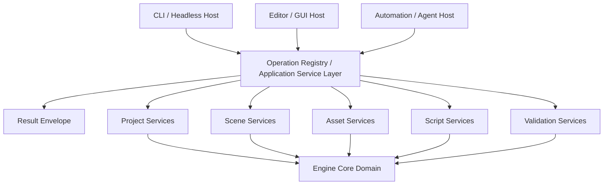

# 技术计划: engine-headless-ai-friendly

> **状态**: approved
> **输入版本**: ai-friendly-headless-blueprint (2026-03-25)
> **创建日期**: 2026-03-25

> **职责说明**: 本文档专注于架构设计和技术决策，不包含具体的实施步骤、测试计划或上线流程。

---

## 1. 概述

本计划的目标，是把 HuaEngine 从“GUI 驱动的引擎”重构为“核心能力可被程序化驱动的引擎”。实现重点不在于先做一个命令行壳，而在于先建立一个能同时服务 `CLI / Headless Host`、`GUI Host` 和 `AI Agent Host` 的统一操作层，使 `Project / Scene / Asset / Script / Validation` 五类能力都不再依赖 GUI 才能正式存在。[host-topology][domain-exposure-path]

当前仓库最有价值的基础不是 Editor，而是已经存在的 Runtime 启动链、Scene/ECS 容器和 JSON 序列化主通路。因此，本计划选择沿现有 `Application -> Scene -> Serialization` 主链演进，通过新增应用服务层、统一结果模型和独立 headless 宿主，完成控制面的重构，而不是围绕 Editor 叠加旁路能力。[host-topology][result-model]

---

## 2. 架构设计

### 2.1 架构视角说明

- 上下文（Context）: HuaEngine 需要同时支持 GUI 用户、CLI/headless 调用者和 AI 代理，但三者必须消费同一套核心能力。
- 容器（Container）: Engine Core Domain、Application Service Layer、Result Model、CLI/Headless Host、GUI Host、Automation/Agent Host。
- 组件（Component）: Project Services、Scene Services、Asset Services、Script Services、Validation Services、Operation Registry、Result Envelope、Editor Adapter、Headless Adapter。
- 部署（Deployment）: 保持 `HuaEngine` 核心库为主，引入新的 headless/CLI 宿主目标；Editor 继续存在，但改为消费应用服务层。

### 2.2 系统架构图

### 2.3 分层说明

| 层级 / 模块 | 职责 | 依赖 | 关联目标 |
|-------------|------|------|----------|
| Engine Core Domain | 持有项目、场景、资源、脚本、验证相关的真实领域状态 | - | 核心能力不依赖 GUI |
| Application Service Layer | 把核心能力组织成稳定操作语义 | Engine Core Domain | 统一无 GUI 操作面 |
| Result Envelope | 提供机器可消费的统一结果边界 | Application Service Layer | AI 友好、自动化可判定 |
| CLI / Headless Host | 提供正式非交互入口 | Application Service Layer, Result Envelope | 正式 headless 宿主 |
| GUI Host | 作为可视化客户端消费相同能力 | Application Service Layer, Result Envelope | GUI 可选客户端 |
| Automation / Agent Host | 为 AI 代理和脚本自动化提供相同调用面 | Application Service Layer, Result Envelope | AI 代理驱动 |

### 2.3A 服务层边界约束

为了避免后续实现把“服务层”误解成一组可以被宿主随意直连的 domain service，这里明确 3 条约束：

- 宿主只能调用 `Operation Registry / Application Service Layer`，不能直接调用 `Project / Scene / Asset / Script / Validation Services`
- 各能力服务是服务层内部的能力子域，不是对宿主公开暴露的自由接口集合
- `Result Envelope` 由服务层统一生成，宿主只能消费结果，不能各自定义私有结果语义

也就是说，真正对外公开的边界不是“五类 service”，而是“一层统一操作面”。
### 2.4 五类能力主题的接入设计

| 能力主题 | 当前主要落点 | 规划接入方式 | 备注 |
|----------|--------------|--------------|------|
| Project | Core Runtime + 新项目上下文服务 | 新增 `Project Services` 统一项目上下文、项目状态检查、初始化能力 | 当前仓库最缺这一层 |
| Scene | Scene / ECS / SceneSerializer | 通过 `Scene Services` 暴露创建、读取、保存、结构校验 | 直接复用现有骨架 |
| Asset | Serialization / Material / Mesh | 通过 `Asset Services` 暴露登记、查询、处理、引用一致性检查 | 后续可与资产注册表统一 |
| Script | Scene System / ScriptableEntity | 通过 `Script Services` 暴露脚本挂接关系、状态检查、验证入口 | 依赖脚本生命周期正式化 |
| Validation | Log / 测试入口 / 诊断服务 | 通过 `Validation Services` 提供统一检查、诊断、继续/中止判断 | 必须是一等能力 |

### 2.5 阶段化架构路线

| 阶段 | 架构焦点 | 完成标志 | 延后项边界 |
|------|----------|----------|------------|
| Phase A: Control Surface Reset | 明确 GUI 不是能力拥有者，只是客户端 | 核心域、宿主、结果模型三层边界被确立 | 不要求立即提供完整 CLI 体验 |
| Phase B: Service Extraction | 从 Runtime / Scene / Serialization 中提取五类能力服务 | Project / Scene / Asset / Script / Validation 都有正式服务落点 | 不要求 GUI 已完全迁移 |
| Phase C: Headless Host Formation | 建立正式 CLI/headless 宿主与统一结果信封 | 非 GUI 可以稳定驱动最小闭环能力 | 不要求覆盖全部后续子系统 |
| Phase D: GUI Rebinding | 让 Editor/GUI 回收为服务消费者 | GUI 与 headless 共享同一能力与结果边界 | 不要求此时完成所有 UX 优化 |
| Phase E: Capability Expansion | 渲染等后续能力继续进入同一操作面 | 新能力不再通过 GUI-first 接入 | 不承诺立即覆盖所有未来系统 |

### 2.6 当前 Gate 对齐快照

- 统一公开入口已经收敛为 `Application::GetOperations()`；`Project / Scene / Asset / Script / Validation` 原始服务不再作为宿主公开面。
- `HuaEngineHeadless` 已成为正式非交互宿主，标准输出以结构化 JSON 为准，适合作为 CLI、脚本和 CI 的稳定控制面。
- `EditorLayer` 与 `SceneHierarchy / Inspector / Console` 已回收为统一操作层消费者；GUI 结果反馈通过 `EditorWorkbenchState + ResultEnvelope + ValidationReport` 归口，不再只依赖零散日志。
- `AgentHostAdapter` 只包装 `ApplicationOperations`，不新增旁路 domain API；AI/automation 宿主与 GUI/headless 共享相同结果语义。
- 渲染扩展缝已落到 `rendering.attach_scene_viewport / rendering.render_scene_viewport`，后续 rendering 能力进入控制面时必须沿这条操作层入口演进，而不是回到 GUI 直连。

这一快照是后续继续演进时的 gate 基线：如果新改动绕过统一操作层、重新把 GUI 变成能力拥有者，或者为 agent/automation 增加私有入口，就视为偏离本规划。

---

## 3. 技术选型

| 领域 | 选型 | 理由 | 备选方案 |
|------|------|------|----------|
| 核心语言 | 升级到 C++20 作为近期主体标准 | 在控制面重构阶段同步引入现代语言特性，为后续服务层、结果模型和宿主边界整理提供更好的类型表达能力 | 继续保持 C++17 |
| 工程组织 | 保持 `HuaEngine` 核心库，新增独立 headless/CLI 宿主目标 | 最能体现“宿主与能力分离”原则 | 在 Editor 中叠加命令模式 |
| 服务层组织 | 新增 Application Service Layer / Capability Facade | 解决 GUI-first 与双轨入口问题 | 直接让宿主调用核心对象 |
| 结果表示 | 统一 `Result Envelope` 结构化结果对象 | 比日志 + 退出码更适合 AI 与自动化 | 继续依赖日志文本与零散状态码 |
| 数据主格式 | 继续以 JSON 作为当前权威作者格式 | 现有序列化主链最成熟，最适合先承载 headless 对象操作 | 立即引入 YAML / Binary 多轨 |
| GUI 定位 | Editor 改为消费统一服务层与结果模型 | 保持 GUI 可用，同时防止回退到 GUI-first | 继续让 Editor 持有部分专属能力 |
| Validation 位置 | Validation 作为正式能力服务，而不是测试附属物 | AI 代理必须可判断是否继续下一步 | 仅保留零散测试入口 |

---

## 4. 依赖分析

### 4.1 内部依赖

- Core Runtime → Engine Core Domain
- Engine Core Domain → Scene / Asset / Script / Validation 子域
- Application Service Layer → Engine Core Domain
- Result Envelope → Application Service Layer
- CLI / Headless Host → Application Service Layer + Result Envelope
- GUI Host → Application Service Layer + Result Envelope
- Automation / Agent Host → Application Service Layer + Result Envelope

### 4.2 外部依赖

| 依赖 | 用途 | 维护状态 | 规划角色 |
|------|------|----------|----------|
| EnTT | Scene / ECS 基础容器 | 稳定 | 继续保留 |
| GLFW | 现有 GUI/窗口宿主依赖 | 稳定 | 保留在 GUI 宿主，不应成为核心能力前提 |
| ImGui | Editor GUI 表现层 | 稳定 | 保留在 GUI 宿主 |
| GLM | 数学类型与序列化对象 | 稳定 | 继续保留 |
| JSON backend | 当前对象化持久化主通路 | 稳定 | 继续作为近期权威作者格式 |

---

## 5. 风险评估

| 风险 | 可能性 | 影响 | 缓解策略 |
|------|--------|------|----------|
| 继续把 CLI 做成 Editor 的旁路接口 | 高 | 高 | 强制引入服务层与独立宿主边界 |
| 没有统一结果模型，AI 友好退化成日志友好 | 高 | 高 | 把 `Result Envelope` 提升为一级架构对象 |
| Project 能力域落点不清，导致 headless 起点不稳定 | 中 | 高 | 先建立项目上下文服务，再向下接 Scene/Asset/Script |
| Script 能力还没正式闭环，导致五类能力中最弱一环拖慢整体 | 中 | 高 | 在服务层里先抽象脚本关系与状态，再补运行时闭环 |
| GUI 迁移不彻底，最终仍形成双套能力语义 | 中 | 高 | 规定 GUI 只能消费服务层，不得持有专属核心能力 |

---

## 6. 安全与合规考虑

- 身份与访问控制: 当前主要是本地单机引擎，不涉及用户鉴权；更重要的是宿主权限边界，即 GUI/CLI/Agent 都不能绕过服务层直接破坏核心域状态。
- 数据保护: Project / Scene / Asset 相关操作结果应有明确目标对象和诊断摘要，避免在自动化链路中出现“改了什么都说不清”的黑盒状态。
- 合规要求: 当前不涉及外部法规；近期更现实的要求是操作面行为一致、对象持久化格式稳定、错误结果可追溯。

---

## 7. 可观测性策略

- **指标设计**: 重点观察五类能力主题的调用成功率、失败分类分布、可恢复错误比例和需人工介入比例。
- **日志策略**: 日志继续保留给人类排障，但不能再作为正式结果边界；正式结果以结构化结果模型为准，日志是补充证据。
- **链路追踪**: 重点追踪 `Host -> Service -> Domain -> Result` 这条控制链，而不是一开始引入复杂分布式追踪体系。
- **告警原则**: 对自动化链路而言，任何不能明确归类为成功/失败/需人工介入的结果都应视为架构缺陷，而不是业务正常情况。

---

## 8. 架构决策记录 (ADR)

### ADR-001: 引擎控制面采用“核心域 + 服务层 + 多宿主”结构

- **状态**: 已采纳
- **上下文**: 当前 GUI 仍承担部分能力入口职责，无法满足 headless-first 目标。
- **决策**: 采用 Engine Core Domain、Application Service Layer、CLI/GUI/Agent 多宿主结构。
- **后果**: 初期需要重构能力入口，但长期能消除 GUI-first 结构性问题。
- **关联目标**: GUI 可选、无 GUI 可操作、AI 友好

### ADR-002: CLI/headless 必须是独立正式宿主，而不是 Editor 的命令模式

- **状态**: 已采纳
- **上下文**: 若沿 Editor 旁路扩展，最终仍会保留 GUI 作为事实入口。
- **决策**: 引入独立 headless/CLI 宿主目标，复用 runtime 与服务层，不复用 EditorLayer 逻辑。
- **后果**: 需要新增宿主目标，但宿主边界清晰。
- **关联目标**: 正式无 GUI 操作面

### ADR-003: Result Envelope 是一级架构对象

- **状态**: 已采纳
- **上下文**: AI 友好不能继续依赖日志文本和零散退出码。
- **决策**: 统一定义结构化结果信封，至少覆盖 `target / status / diagnostics / payload`。
- **后果**: 所有能力服务都必须适配该结果模型，但自动化可判定性会大幅提升。
- **关联目标**: AI 友好、机器可读反馈

### ADR-004: Validation 是正式能力域，不是附属测试工具

- **状态**: 已采纳
- **上下文**: 没有可继续决策的验证能力，AI 代理链路无法闭环。
- **决策**: 将 Validation 建为正式服务域，和 Project / Scene / Asset / Script 并列。
- **后果**: 需要从零散测试入口上收回职责，但能为自动化和阶段判断提供统一依据。
- **关联目标**: headless 工作流、AI 代理驱动

### ADR-005: 近期升级到 C++20，并保持 JSON 主通路稳定

- **状态**: 已采纳
- **上下文**: 既然规划目标已经明确要求引擎更适合长期模块化扩展和 AI 友好操作面，那么语言层也应提前切到更现代的基线，避免后续服务层、结果模型和宿主拆分再次被语言边界束缚。
- **决策**: 近期将核心实现标准升级到 C++20，同时继续保持 JSON 作为权威作者格式。
- **后果**: 需要承担一次语言标准切换和兼容性确认成本，但能让后续架构演进建立在更现代、统一的语言基线上。
- **关联目标**: 平稳演进、风险控制

---

## 9. 规划结论

### 9.1 当前最重要的技术判断

这次演进的核心，不是“做一个 CLI 工具”，而是“重构引擎的控制面”。真正的第一优先级不是命令集合，而是：

- 宿主边界重组
- 服务层建立
- 结果模型统一
- 五类能力正式化

### 9.2 后续规划输入约束

后续如果再继续拆到任务层，应始终以这 4 条作为输入约束：

- 不允许新增“只能通过 GUI 使用”的核心能力
- 不允许宿主直接绕过服务层操作核心域
- 不允许把日志文本当作正式结果协议
- 不允许在五类最小覆盖面闭环前，把重点资源转移到更外围子系统

### 9.3 什么时候说明规划成功

当你能做到下面这些时，这份规划就开始真正落地了：

- GUI 关闭后，最小闭环能力仍然正式可用
- AI 代理可以连续驱动多个核心操作并判断下一步
- GUI 与 headless 只是不同宿主，而不是不同能力系统
- 后续新能力默认思考“怎么进入统一操作面”，而不是“先做个 GUI 面板再说”

---

## 10. 调研引用索引

- [host-topology](research/host-topology/research.md)
- [result-model](research/result-model/research.md)
- [domain-exposure-path](research/domain-exposure-path/research.md)

---

*Generated by workflow-plan | 2026-03-25*
