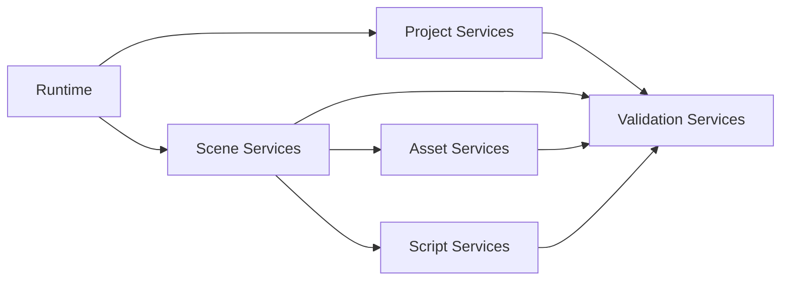

# 调研报告: domain-exposure-path

## SCOPE
- 调研目标: 确定五类能力主题如何映射到当前仓库模块骨架。
- 核心问题: 哪些现有模块可直接复用，哪些需要新增抽象层。
- 评估维度: 落地可行性、最小改造路径、对 GUI 解耦的支持度。

## GATHER
- Evidence: [E-1](evidence/evidence-1.md) [E-2](evidence/evidence-2.md)

## ANALYZE
| 主题 | 主要落点 | 当前缺口 |
|------|----------|----------|
| Project | Core Runtime / 新项目上下文服务 | 缺少正式项目级操作层 |
| Scene | Scene / ECS / SceneSerializer | 缺少正式无 GUI 操作入口 |
| Asset | Serialization / Material / Mesh | 缺少统一操作层与状态反馈 |
| Script | Scene System / ScriptableEntity | 生命周期尚未成为正式能力 |
| Validation | Log / 测试入口 / 新验证服务 | 缺少一级能力定位 |

## COMPARE
| 方案 | 优点 | 问题 |
|------|------|------|
| 基于现有骨架新增应用服务层统一暴露五类能力 | 改造连续、风险可控 | 需要系统性重构能力入口 |
| 分别在 GUI / CLI 各自扩展能力入口 | 改起来局部更快 | 会形成双轨能力分裂 |

## RECOMMEND
推荐围绕现有 Runtime / Scene / Serialization 骨架新增统一应用服务层，把五类能力主题分别挂到正式服务上，再由 GUI/CLI/Agent 共同消费。[E-1][E-2]

## Sources
- [E-1](evidence/evidence-1.md)
- [E-2](evidence/evidence-2.md)
