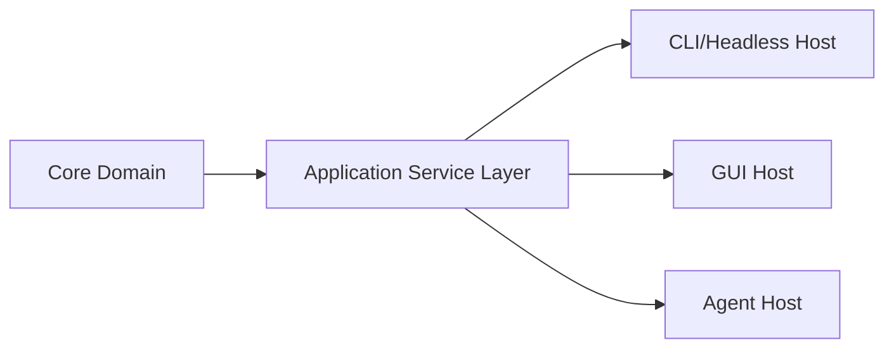

# 调研报告: host-topology

## SCOPE
- 调研目标: 确定 GUI、CLI、Agent 与核心域之间的宿主关系。
- 核心问题: 是否需要独立 headless 宿主；GUI 应如何从能力拥有者转为消费者。
- 评估维度: 与现有 runtime 链一致性、可维护性、GUI 解耦程度。

## GATHER
- Evidence: [E-1](evidence/evidence-1.md) [E-2](evidence/evidence-2.md)

## ANALYZE
| 观察项 | 现状 | 影响 |
|--------|------|------|
| 启动链 | 已有统一 Application 主链 | 新宿主可复用同一 runtime 基础 |
| GUI 角色 | EditorLayer 仍承担能力入口职责 | 必须引入中间应用服务层完成解耦 |

## COMPARE
| 方案 | 优点 | 问题 |
|------|------|------|
| 新增独立 headless host + 统一应用服务层 | 宿主边界清晰，GUI 可退化为客户端 | 需要新增一层组织结构 |
| 在 Editor 中叠加命令模式 | 短期改动少 | 长期仍是 GUI-first |

## RECOMMEND
推荐采用“独立 headless 宿主 + 统一应用服务层 + GUI 客户端化”的宿主拓扑。[E-1][E-2]

## Sources
- [E-1](evidence/evidence-1.md)
- [E-2](evidence/evidence-2.md)
