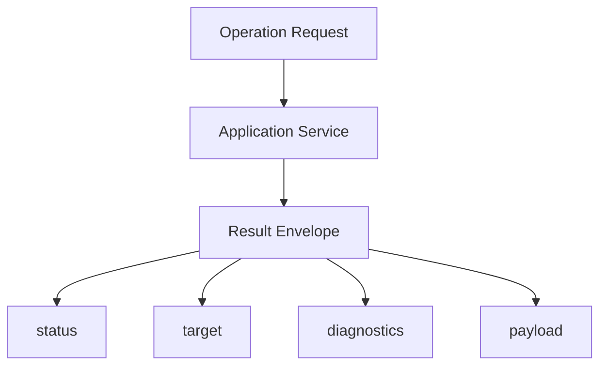

# 调研报告: result-model

## SCOPE
- 调研目标: 确定 AI 友好操作面的最小结果模型与状态边界。
- 核心问题: 如何让调用结果既适合机器消费，又与现有引擎对象化能力兼容。
- 评估维度: 机器可消费性、可判定性、与当前日志/序列化基础的一致性。

## GATHER
- Evidence: [E-1](evidence/evidence-1.md) [E-2](evidence/evidence-2.md)

## ANALYZE
| 观察项 | 现状 | 影响 |
|--------|------|------|
| 反馈主通道 | 当前主要是日志 | 对 AI/自动化不够稳定 |
| 对象化能力 | 当前序列化链已成熟到可承载结构化结果 | 可以复用现有数据表达思路 |

## COMPARE
| 方案 | 优点 | 问题 |
|------|------|------|
| 统一结果信封 + 状态分类 + 诊断摘要 | 稳定、可判定、适合 CLI/GUI/Agent 共享 | 需要一层标准化设计 |
| 继续依赖日志 + 退出码 | 简单 | 信息不足，无法支撑复杂自动化 |

## RECOMMEND
推荐把 `Result Envelope` 作为正式架构对象，至少统一 `target / status / diagnostics / payload` 这四类结果信息。[E-1][E-2]

## Sources
- [E-1](evidence/evidence-1.md)
- [E-2](evidence/evidence-2.md)
