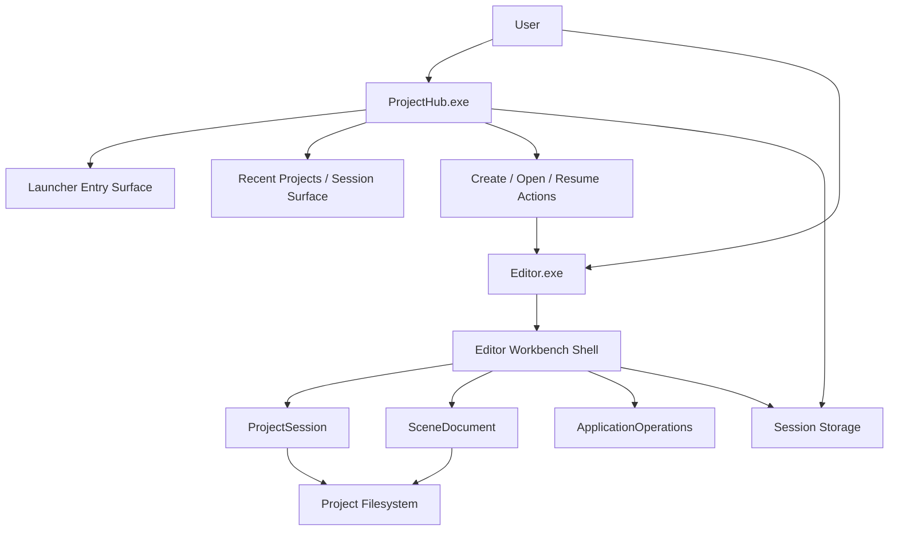

# Technical Plan: engine-project-launcher-separation

> **Status**: approved
> **Spec Version**: 1.0.0
> **Created Date**: 2026-03-28

> **Responsibility Note**: This plan defines architecture and technical decisions only. It does not decompose implementation tasks, test plans, or release procedures.

---

## 1. Overview

The current Editor workbench closure solved the core project-editing loop, but the startup surface is still product-shaped as an embedded launcher inside `Editor.exe`. The next step is to split the startup experience into a dedicated launcher host, so the engine more closely matches modern engines:

- `ProjectHub.exe` for create/open/resume project workflows
- `Editor.exe` for project-bound editing workflows

This plan keeps the existing workbench model intact and focuses on host separation, ownership clarity, and a stable handoff contract. It also treats the current oversized Project Hub card as a symptom of the wrong host boundary rather than something to optimize into a permanent Editor startup mode. [launcher-topology][entry-surface-boundary]

---

## 2. Architecture Design

### 2.1 Architectural View

- Context: local desktop tooling for HuaEngine project entry and editing
- Containers: `ProjectHub.exe`, `Editor.exe`, shared engine/runtime library surfaces, project filesystem
- Components: launcher entry shell, session/recent-project storage, editor workbench shell, command-line handoff contract
- Deployment: separate desktop executables in the same build output root

### 2.2 System Architecture

### 2.3 Module Summary

| Module | Responsibility | Dependencies | Related Requirements |
|--------|----------------|--------------|----------------------|
| `ProjectHub.exe` | own the no-project startup and project entry UX | session storage, process launch, project operations | FR-1, FR-5 |
| launcher entry surface | create/open/resume project UI | ProjectHub host, session storage | FR-1, FR-3 |
| `Editor.exe` | own the project-bound workbench only | ProjectSession, SceneDocument, ApplicationOperations | FR-2, FR-4 |
| shared startup contract | pass project and optional scene into Editor | command-line arguments | FR-4 |
| session storage surface | expose recent/resumable projects to launcher and workbench | local storage | FR-5 |

### 2.4 Key Design Decisions

#### A. Preferred product entry

`ProjectHub.exe` becomes the authoritative no-project entry point. `Editor.exe` remains directly usable for:

- `--project <path>`
- `--project <path> --scene <path>`

#### B. Editor no-project behavior

`Editor.exe` should no longer own a full embedded launcher UI. When started without project context, it should keep only a minimal fallback path:

- either hand off to `ProjectHub.exe`
- or show a small recovery/error surface that points users to the launcher

The full launcher experience should not remain embedded in `EditorLayer`. [entry-surface-boundary]

#### C. Session ownership

Recent-project and persisted session metadata should be lifted to a launcher-facing shared surface instead of remaining an Editor-only concern. The first milestone can still reuse the existing session storage format, but ownership should conceptually move from "Editor startup detail" to "shared entry-state contract".

#### D. Handoff protocol

The first milestone should use process launch with command-line arguments, not IPC. The current repository already supports the required contract, so the launcher can stay simple and robust. [launcher-topology]

### 2.5 Runtime Flows

#### Flow 1: Standard startup

1. user starts `ProjectHub.exe`
2. launcher shows create/open/resume UI
3. launcher resolves project target
4. launcher starts `Editor.exe --project <path> [--scene <path>]`
5. launcher exits or remains as a lightweight shell, depending on final UX choice

#### Flow 2: Direct project startup

1. user starts `Editor.exe --project <path>`
2. Editor skips launcher concerns
3. Editor activates `ProjectSession`
4. Editor enters workbench shell

#### Flow 3: Invalid Editor startup

1. user starts `Editor.exe` without a project
2. Editor uses a minimal fallback path
3. Editor either launches `ProjectHub.exe` or shows a lightweight redirect surface

### 2.6 Scope Boundary

This stage must do:

- separate launcher host
- remove full launcher ownership from Editor startup
- preserve direct `--project` editor startup
- keep recent/resume entry discoverable

This stage explicitly defers:

- project template marketplace
- engine version selection
- multi-instance launcher coordination
- richer asset browser or content discovery redesign

---

## 3. Technology Choices

| Area | Choice | Reason | Alternative |
|------|--------|--------|-------------|
| launcher host UI | ImGui-based standalone executable | lowest integration cost and consistent with current GUI stack | new native UI stack |
| launcher-editor handoff | process launch with command-line args | already supported by repository and easy to validate | IPC/RPC handoff |
| shared state | reuse existing session storage surface first | keeps current workbench closure reusable | invent a new launcher-only database immediately |
| Editor startup model | project-bound workbench host | cleaner responsibility split | keep embedded launcher indefinitely |

---

## 4. Dependency Analysis

### 4.1 Internal Dependencies

- launcher host -> shared session storage surface
- launcher host -> project open/create operations
- launcher host -> Editor command-line contract
- Editor workbench -> ProjectSession / SceneDocument / ApplicationOperations

### 4.2 External Dependencies

| Dependency | Version | Use | Maintenance Status |
|------------|---------|-----|--------------------|
| ImGui | existing repo version | launcher and editor GUI | stable in-repo dependency |
| GLFW/OpenGL stack | existing repo version | launcher/editor desktop shell | stable in-repo dependency |
| std::filesystem / process launch on Windows | toolchain-provided | project path/session persistence and process handoff | stable |

---

## 5. Risk Assessment

| Risk | Likelihood | Impact | Mitigation |
|------|------------|--------|------------|
| duplicated startup logic between launcher and editor | Medium | High | centralize shared launch/session parsing and keep Editor project-bound |
| launcher grows into a second workbench | Medium | High | keep first milestone limited to create/open/resume only |
| removing embedded launcher hurts recovery/debug paths | Medium | Medium | keep a minimal Editor fallback handoff state |
| session ownership becomes ambiguous | Medium | Medium | define launcher-facing ownership explicitly in the shared entry-state model |

---

## 6. Security and Compliance Considerations

- Identity/access control: not a primary concern in this local desktop milestone
- Data protection: project paths and recent-project metadata should remain local-only
- Auditability: launcher-to-editor handoff should be loggable through existing file logging

---

## 7. Observability Strategy

- Metrics design: launcher startup success, editor handoff success, invalid startup redirect count
- Logging strategy: launcher start/open/create/handoff events should be logged to the same local logging root model
- Traceability: project selection and editor launch target should be visible in logs
- Alerting principle: this stage only needs local diagnosability, not remote monitoring

---

## 8. Architecture Decision Records

### ADR-001: Separate launcher and workbench into different executables

- **Status**: accepted
- **Context**: the repository already has a working project workbench, but startup entry is still product-shaped as embedded launcher UI inside Editor.
- **Decision**: introduce `ProjectHub.exe` as the launcher host and keep `Editor.exe` as the workbench host.
- **Consequence**: build graph and startup ownership become more complex, but the user-facing product model becomes clearer and closer to modern engines.
- **Related Requirements**: FR-1, FR-2, NFR-1

### ADR-002: Use command-line handoff instead of IPC in the first milestone

- **Status**: accepted
- **Context**: the repository already supports `Editor.exe --project [--scene]`.
- **Decision**: launcher starts Editor through process launch and command-line arguments.
- **Consequence**: the first split remains simple and low-risk; richer coordination can be deferred.
- **Related Requirements**: FR-4, NFR-3

### ADR-003: Remove full launcher UI ownership from Editor startup

- **Status**: accepted
- **Context**: the current oversized Project Hub shell is a consequence of embedding launcher UX inside Editor runtime.
- **Decision**: keep only a minimal Editor fallback surface; move real create/open/resume UX into `ProjectHub.exe`.
- **Consequence**: Editor startup becomes cleaner, but a launcher binary becomes part of the formal product surface.
- **Related Requirements**: FR-3, NFR-1

### ADR-004: Keep session/recent-project data as a shared entry-state contract

- **Status**: accepted
- **Context**: session persistence currently exists as an Editor-centered capability.
- **Decision**: treat it as shared launcher/editor entry-state data rather than purely Editor-internal startup state.
- **Consequence**: existing storage can be reused short-term, but ownership semantics become clearer.
- **Related Requirements**: FR-5, NFR-2

---

## 9. Planning Conclusion

The next architecture step is not to keep polishing the embedded Project Hub inside `Editor.exe`. The cleaner direction is to split the product into:

- a launcher executable that owns project entry
- a workbench executable that owns project editing

That gives HuaEngine a more modern engine shape while preserving the project/session/workbench foundations already built. The recommended first milestone is intentionally narrow: make the launcher real, keep Editor project-bound, and reuse the existing command-line handoff instead of introducing a heavier coordination layer. [launcher-topology][entry-surface-boundary]

---

## 10. Research References

- [launcher-topology](research/launcher-topology/research.md)
- [entry-surface-boundary](research/entry-surface-boundary/research.md)

*Generated by workflow-plan | 2026-03-28*
