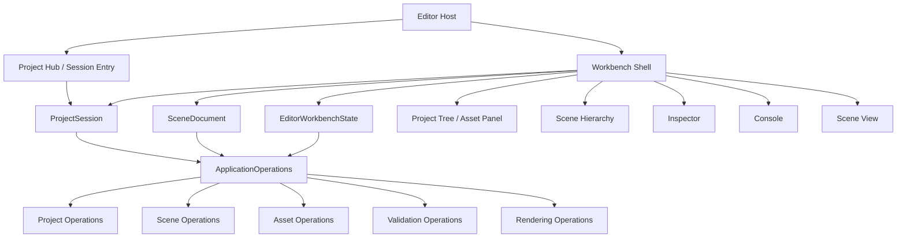

# 技术计划: engine-project-workbench-closure

> **状态**: approved
> **输入版本**: engine-project-workbench-closure/specify (2026-03-28)
> **创建日期**: 2026-03-28

> **职责说明**: 本文档只定义“如何建立最小可用项目工作台闭环”的架构设计和技术决策，不展开到具体提交或逐行实现步骤。

---

## 1. 概述

本计划的目标，是让 HuaEngine 的 `Editor` 从“固定 workbench 演示壳”演进为“围绕正式工程目录工作的最小项目工作台”。这不是一次完整工具链工程，而是一次围绕实际可用性的控制面补全: 让用户可以在 GUI 中完成 `创建工程 -> 打开工程 -> 创建/加载场景 -> 编辑 -> 保存 -> 重新打开` 的闭环，并且整个闭环继续建立在已经收口好的 `ApplicationOperations` 上，而不是重新回到 GUI 直连 domain service 的旧模式。[project-workbench-topology][scene-document-lifecycle][asset-workspace-minimum]

当前仓库的优势，是项目、场景、资产和验证的底层服务已经存在，Editor 也已经有稳定的 `Scene / Hierarchy / Inspector / Console` 基础工作台。因此这次规划不需要从零设计编辑器，而是需要补齐“正式工程会话”和“场景文档模型”这两个缺失层，把已有能力从内部 workbench 壳推进成真正可用的项目工作台。[project-workbench-topology][scene-document-lifecycle]

---

## 2. 架构设计

### 2.1 架构目标

- 显式化当前工程，而不是隐式复用固定本地 workbench
- 显式化当前场景文档，而不是只持有裸 `Ref<Scene>`
- 保持 GUI 继续消费统一 `ApplicationOperations`
- 在当前阶段建立最小项目树/资产视图，帮助用户理解工程上下文
- 保持后续向最近工程、项目模板、资源导入和多文档工作流扩展的余地

### 2.2 目标架构图

### 2.3 分层说明

| 层级 / 对象 | 职责 | 当前变化点 |
|-------------|------|------------|
| Editor Host | 提供 GUI 壳和事件循环 | 保持单宿主，不另起复杂启动器 |
| Project Hub / Session Entry | 负责创建工程、打开工程、恢复最近一次工程入口 | 新增 |
| ProjectSession | 表达当前工程上下文、工程状态、当前项目根与元信息 | 新增 |
| SceneDocument | 表达当前场景对象、路径、脏状态、来源与最近一次保存目标 | 新增 |
| EditorWorkbenchState | 承接结果、诊断和工作台事件，同时引用当前 session/document 摘要 | 扩展 |
| Project Tree / Asset Panel | 以工程目录为中心展示最小项目树与场景入口 | 新增 |
| Existing Panels | 继续消费当前场景与工作台状态 | 适配 |
| ApplicationOperations | 继续作为唯一正式 GUI 能力入口 | 保持 |

### 2.4 关键对象设计

#### A. ProjectSession

建议最小字段:

- `ProjectContext Context`
- `ProjectStatusReport LastStatus`
- `std::filesystem::path LastOpenedScenePath`
- `bool Loaded`

职责:

- 标识当前工程
- 承接工程级状态检查结果
- 为项目树、场景保存与恢复提供共同根路径

#### B. SceneDocument

建议最小字段:

- `Ref<Scene> Scene`
- `std::filesystem::path ScenePath`
- `std::string DisplayName`
- `bool Dirty`
- `enum class Source { NewScene, LoadedFromDisk }`

职责:

- 明确场景文档身份
- 为 `Save / Save As / Close / Reload` 提供稳定目标
- 为切换工程/切换场景时的脏文档处理提供依据

#### C. EditorWorkbenchState

当前只承接结果与验证，需要扩展为:

- 当前项目摘要
- 当前场景文档摘要
- 最近一次操作结果
- 最近一次验证结果
- 最近事件历史

这样 Console、Project Panel、Scene Hierarchy 和 Inspector 才能围绕同一会话状态展示。

### 2.5 运行时工作流

#### 工作流 1: 打开 Editor

1. Editor 启动后进入 `Project Hub`
2. 用户选择 `Create Project` 或 `Open Project`
3. 成功后构建 `ProjectSession`
4. Session 就绪后进入 `Workbench Shell`
5. 如果存在上次场景记录且文件可用，则尝试恢复；否则进入空场景或项目默认场景

#### 工作流 2: 新建场景

1. 从 `Workbench Shell` 触发 `New Scene`
2. 如当前文档 `Dirty`，先进行保存确认
3. 调用 `ApplicationOperations::CreateScene`
4. 建立新的 `SceneDocument`
5. 重新绑定 Hierarchy / Inspector / Viewport / Validation

#### 工作流 3: 打开场景

1. 从项目树或菜单选择场景文件
2. 如当前文档 `Dirty`，先进行保存确认
3. 调用 `ApplicationOperations::LoadScene`
4. 建立新的 `SceneDocument`
5. 更新 `ProjectSession.LastOpenedScenePath`

#### 工作流 4: 保存场景

1. 由 `SceneDocument` 决定当前保存目标
2. `Save` 优先使用既有 `ScenePath`
3. `Save As` 默认从当前工程 `SceneRoot` 选取目标
4. 保存成功后刷新文档状态、工程状态和验证结果

### 2.6 最小 GUI 面设计

当前阶段建议工作台最小布局为:

- 左侧: `Project` 面板
- 左中: `Scene Hierarchy`
- 中间: `Scene`
- 右侧: `Inspector`
- 下方: `Console`

`Project` 面板初版承担 3 件事:

- 显示当前工程根与工程名
- 列出 `Assets/`、`Scenes/` 的目录树
- 允许双击/按钮打开场景文件

### 2.7 范围边界

当前阶段必须做:

- 显式创建工程
- 显式打开工程
- 显式场景文档模型
- 项目树/资产树最小面板
- 项目会话和场景保存恢复闭环

当前阶段明确延后:

- 最近工程列表
- 原生文件对话框
- 多场景标签
- 资产导入向导
- 缩略图和高级内容浏览器 UX
- 复杂撤销/重做体系

---

## 3. 技术选型

| 领域 | 选型 | 理由 | 备选方案 |
|------|------|------|----------|
| 项目入口 | Editor 内嵌 `Project Hub` 状态 | 成本最低，最适合最小闭环 | 单独欢迎器进程 |
| 工程会话模型 | `ProjectSession` 显式对象 | 避免工程状态散落在 `EditorLayer` 局部字段里 | 继续直接持有 `ProjectContext` |
| 场景文档模型 | `SceneDocument` 显式对象 | 支撑保存、切换、dirty state | 继续只持有 `Ref<Scene>` |
| 项目视图 | 基于目录树的 `Project Panel` | 贴合当前仓库和最小闭环 | 直接做重型 asset browser |
| 能力入口 | 继续复用 `ApplicationOperations` | 维持既有统一操作层约束 | 回退到 GUI 直连原始服务 |
| 路径输入 | 初版允许文本路径/约定路径 | 比接平台原生 dialog 更快建立闭环 | 先做原生文件选择器 |

---

## 4. 依赖分析

### 4.1 内部依赖

- `EditorLayer` 依赖 `ProjectSession` 与 `SceneDocument`
- `ProjectSession` 依赖 `ProjectContext / ProjectStatusReport / ApplicationOperations`
- `SceneDocument` 依赖 `Scene / ApplicationOperations`
- `Project Panel` 依赖 `ProjectSession`
- `Scene Hierarchy / Inspector / Viewport` 依赖 `SceneDocument`
- `Console / Diagnostics` 依赖 `EditorWorkbenchState`

### 4.2 外部依赖

| 依赖 | 用途 | 规划角色 |
|------|------|----------|
| ImGui | Project Hub、Project Panel、现有工作台面板 | 继续保留 |
| std::filesystem | 工程路径、项目树、场景保存路径 | 继续保留 |
| JSON serialization | 工程与场景持久化 | 继续保留 |
| Existing ApplicationOperations | 正式 GUI 控制面 | 必须继续复用 |

---

## 5. 风险评估

| 风险 | 可能性 | 影响 | 缓解策略 |
|------|--------|------|----------|
| 继续把“打开工程”写成 Editor 私有旁路逻辑 | 中 | 高 | 强制所有入口通过 `ApplicationOperations` 和 `ProjectService` |
| 没有 `SceneDocument` 导致保存/切换逻辑继续混乱 | 高 | 高 | 把文档对象设为当前阶段一级对象 |
| 项目树范围膨胀成重型内容浏览器 | 中 | 中 | 明确本阶段只做目录树和场景入口 |
| 切换工程/场景时脏文档处理不足 | 中 | 高 | 先做最小保存确认与拒绝切换路径 |
| Project Hub 过度设计拖慢闭环 | 中 | 中 | 维持“嵌入式最小入口”方案 |

---

## 6. 可观测性策略

- 工作台结果继续统一落到 `EditorWorkbenchState`
- 新增项目会话和场景文档摘要，供 Console/Project Panel 统一展示
- 项目创建/打开、场景加载/保存、验证刷新都要产生可回看的形式化事件
- GUI 闭环回归测试应至少覆盖:
  - 创建工程并进入工作台
  - 打开工程并恢复场景
  - 新建场景并保存
  - 打开项目树中的场景

---

## 7. 架构决策记录 (ADR)

### ADR-001: Editor 项目生命周期显式化

- **状态**: 已采纳
- **上下文**: 当前 Editor 仍依赖固定本地 workbench 根目录启动。
- **决策**: 引入显式 `Project Hub / ProjectSession`，让工程入口成为正式 GUI 状态。
- **后果**: 启动流程会更复杂，但工程工作流才能真正闭环。

### ADR-002: 场景作为文档而不是裸 runtime scene

- **状态**: 已采纳
- **上下文**: 仅有 `Ref<Scene>` 无法支撑保存、切换和脏状态管理。
- **决策**: 引入最小 `SceneDocument` 对象。
- **后果**: 需要重绑若干面板状态，但能换来正式场景工作流。

### ADR-003: 项目视图初版采用目录树，而不是重型资产浏览器

- **状态**: 已采纳
- **上下文**: 当前资产系统和工具链还不支持一步到位做成熟内容浏览器。
- **决策**: 初版只做基于工程目录的 `Project Panel`。
- **后果**: 体验朴素，但更符合当前“先能用起来”的目标。

### ADR-004: GUI 继续只消费统一操作层

- **状态**: 已采纳
- **上下文**: 既有重构已经把统一公开能力入口收敛到 `ApplicationOperations`。
- **决策**: 创建工程、打开工程、场景保存/加载、验证刷新都继续通过 `ApplicationOperations`。
- **后果**: 有些 GUI 逻辑要多包一层状态对象，但能保证架构不回退。

---

## 8. 规划结论

本次规划的核心不是“多加几个 Editor 面板”，而是补齐两层此前缺失的正式对象:

- `ProjectSession`
- `SceneDocument`

只要这两层落下来，再配一个轻量 `Project Panel`，当前 Editor 就可以从内部 workbench 壳推进成真正可用的最小项目工作台。当前阶段真正的完成标志，不是工具看起来多高级，而是用户能围绕正式工程目录稳定工作，而不是每次都回到内置临时项目。

---

## 9. 调研引用索引

- [project-workbench-topology](research/project-workbench-topology/research.md)
- [scene-document-lifecycle](research/scene-document-lifecycle/research.md)
- [asset-workspace-minimum](research/asset-workspace-minimum/research.md)

---

*Generated by workflow-plan | 2026-03-28*
