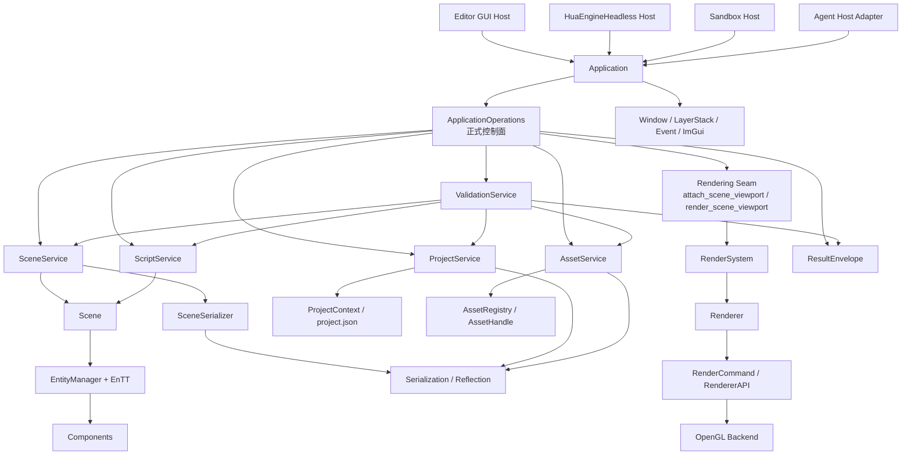
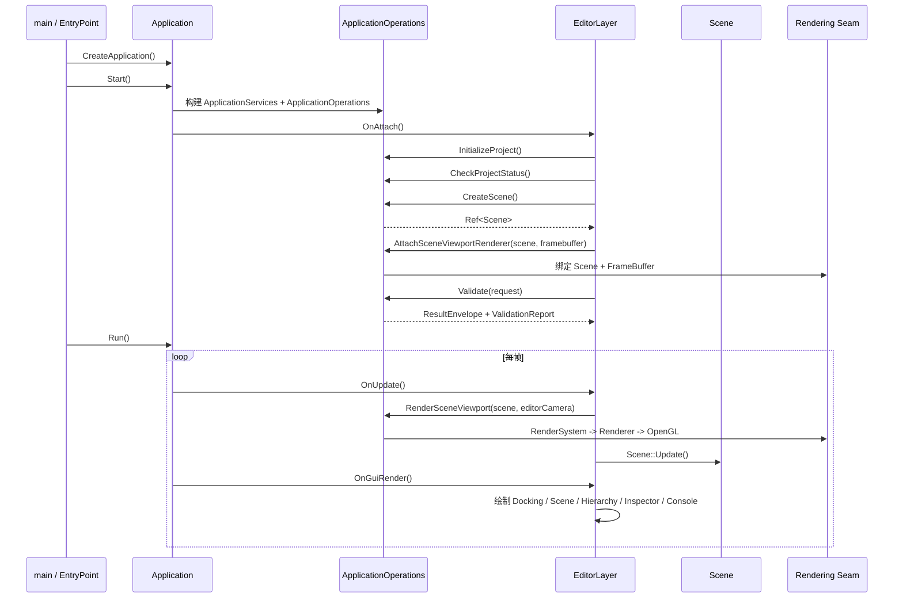
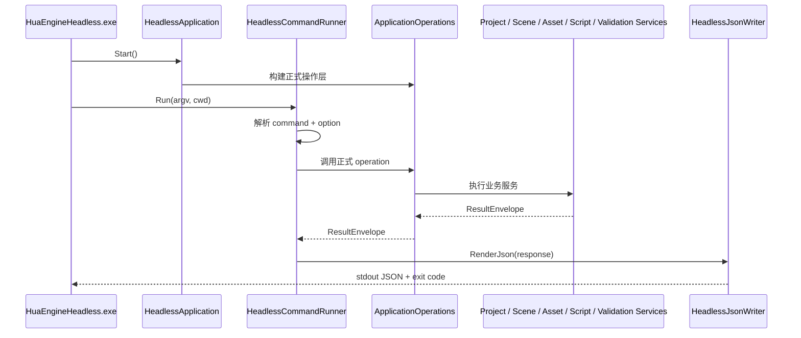
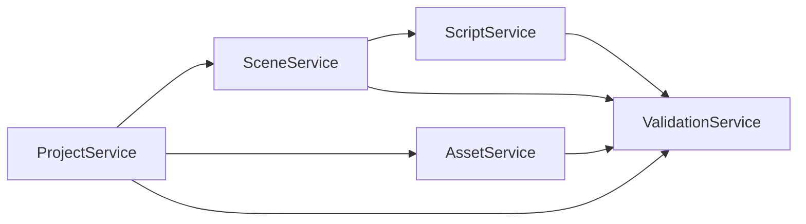

# HuaEngine 重构后架构说明

## 1. 一句话理解

当前重构后的 HuaEngine，可以先用一句话理解：

`宿主层变薄，正式能力统一收口到 ApplicationOperations，底下再组合 Project / Scene / Asset / Script / Validation 五类服务，GUI、Headless、Agent 共享同一套控制语义。`

这和旧形态最大的区别是两点：

- 宿主不再直接到处摸底层模块，而是优先走正式控制面
- GUI 和无 GUI 不再是两套思路，而是共享同一套 `ResultEnvelope + ApplicationOperations`

## 2. 现在的分层结构

建议把当前引擎按 4 层理解：

### 2.1 Host 层

这一层只负责“交互形态”，不负责重新定义领域能力。

- `Editor`
- `HuaEngineHeadless`
- `Sandbox`
- `AgentHostAdapter`

### 2.2 Control 层

这一层是现在的正式控制协议。

- `Application`
- `ApplicationOperations`
- `OperationRegistry`
- `ResultEnvelope`

### 2.3 Domain 层

这一层是正式业务服务。

- `ProjectService`
- `SceneService`
- `AssetService`
- `ScriptService`
- `ValidationService`

### 2.4 Engine Core 层

这一层负责底层实现，不直接暴露给宿主做随意编排。

- `ECS / Scene`
- `Serialization / Reflection`
- `Rendering / RenderSystem / Renderer`
- `OpenGL Backend`
- `Window / Event / ImGui / LayerStack`

## 3. 静态架构图

## 4. 关键设计原则

### 4.1 宿主只负责消费，不负责发明能力

现在的 `Editor` 和 `Headless` 都不应该各自长出一套独立的业务 API。

正确方向是：

- `Editor` 负责 GUI 展示和交互
- `Headless` 负责 CLI/JSON 输出
- 正式能力统一由 `ApplicationOperations` 暴露

### 4.2 正式能力必须有统一结果语义

所有正式操作最终都应该返回：

- `ResultEnvelope`

这意味着上层自动化、GUI 状态面板、CLI JSON 输出看到的是同一套语义：

- `operation`
- `target`
- `status`
- `summary`
- `payload`
- `details`

### 4.3 服务层是业务规则收口点

当前五类服务各自负责不同边界：

- `ProjectService`
  - 项目根、`.huaengine/project.json`、托管目录
- `SceneService`
  - 场景创建、加载、保存、结构校验
- `AssetService`
  - `AssetHandle`、注册表、mesh/material/texture 资产
- `ScriptService`
  - 脚本绑定、初始化、更新、销毁、状态检查
- `ValidationService`
  - 聚合多域验证

### 4.4 Rendering 已经有正式 seam

宿主现在不该直接把 raw `RenderSystem` 当公共控制面。

正式渲染接入点是：

- `rendering.attach_scene_viewport`
- `rendering.render_scene_viewport`

也就是由 `ApplicationOperations` 暴露的 rendering seam。

## 5. GUI 启动与每帧运行时序

下面这条图描述的是 `Editor` 现在怎么启动、怎么消费正式控制面、怎么在每帧里驱动渲染和 GUI。

### 5.1 这条时序的关键点

- `Application::Start()` 负责把 runtime 和正式操作层先建起来
- `EditorLayer` 不再自己发明项目/场景编排协议，而是走 `ApplicationOperations`
- Scene viewport 的渲染也不是 GUI 直接摸底层渲染器，而是走正式 rendering seam
- Editor 面板消费的是：
  - `Scene` 事实
  - `ResultEnvelope`
  - `ValidationReport`

## 6. Headless / CLI 时序

这条图描述的是 `HuaEngineHeadless.exe` 如何把命令行请求变成正式 operation，再把结果写回 JSON。

### 6.1 这条时序的关键点

- Headless 并没有自己实现一套业务层
- CLI 只是解析命令，然后映射到正式 operation
- 结果输出不是日志拼接，而是正式 JSON 协议
- 所以 CLI、GUI、Agent 在语义上是一致的，只是表现形式不同

## 7. 五类正式能力的关系

可以这样理解依赖方向：

- 项目是根上下文
- 场景和资产都依赖项目边界
- 脚本依赖场景运行时
- 校验服务负责汇总这些域的健康状态

## 8. 现在的宿主分工

### 8.1 Editor

职责：

- 提供 GUI 工作台
- 显示 Scene/Inspector/Console
- 消费正式控制面与验证语义

不再负责：

- 定义独立业务协议
- 绕过控制层直连各类服务做正式编排

### 8.2 HuaEngineHeadless

职责：

- 提供无 GUI 正式控制面
- 接收命令行参数
- 输出结构化 JSON

不再负责：

- 在宿主层私自实现领域逻辑

### 8.3 Sandbox

职责：

- 做引擎能力试验和快速验证

定位仍偏实验性，而不是正式自动化入口。

## 9. 当前你应该怎么读这个引擎

如果你以后继续开发，建议按下面顺序判断改动落点：

### 9.1 先问自己：这是宿主问题，还是正式能力问题

- 如果是 GUI 展示、Docking、Inspector 交互：
  - 看 `Editor`
- 如果是 CLI 参数、JSON 输出：
  - 看 `Headless`
- 如果是项目、场景、资产、脚本、校验本身：
  - 看 `ApplicationOperations` 和五类服务

### 9.2 再问自己：这是控制层问题，还是底层实现问题

- 如果是正式操作边界、返回语义、跨宿主一致性：
  - 看 `ApplicationOperations`
- 如果是序列化细节、场景实体恢复、OpenGL 渲染结果：
  - 再下钻到具体子系统

### 9.3 最后再进 Core 层

Core 层现在更像：

- 实现层
- 支撑层
- 被正式服务和正式控制面组合使用的能力层

而不是让宿主随意拼接的公共脚手架。

## 10. 关键文件索引

### 10.1 Host / Control

- `HuaEngine/src/HuaEngine/Application.h`
- `HuaEngine/src/HuaEngine/Application.cpp`
- `HuaEngine/src/HuaEngine/Application/ApplicationOperations.h`
- `HuaEngine/src/HuaEngine/Application/ApplicationOperations.cpp`
- `HuaEngine/src/HuaEngine/Application/ApplicationServices.h`
- `HuaEngine/src/HuaEngine/Core/ResultEnvelope.h`

### 10.2 Domain

- `HuaEngine/src/HuaEngine/Project/ProjectService.h`
- `HuaEngine/src/HuaEngine/Scene/SceneService.h`
- `HuaEngine/src/HuaEngine/Asset/AssetService.h`
- `HuaEngine/src/HuaEngine/Script/ScriptService.h`
- `HuaEngine/src/HuaEngine/Validation/ValidationService.h`

### 10.3 Hosts

- `Editor/src/EditorApp.cpp`
- `Editor/src/EditorLayer.cpp`
- `Headless/src/main.cpp`
- `Headless/src/HeadlessCommandRunner.cpp`
- `Sandbox/src/SandboxApp.cpp`

### 10.4 Core

- `HuaEngine/src/HuaEngine/Scene/Scene.h`
- `HuaEngine/src/HuaEngine/Scene/SceneSerializer.cpp`
- `HuaEngine/src/Module/Rendering/RenderSystem.cpp`
- `HuaEngine/src/HuaEngine/Serialization/SerializationCore.h`
- `HuaEngine/src/HuaEngine/Serialization/JsonSerializationBackend.cpp`

## 11. 最后总结

当前这次重构之后，HuaEngine 的核心形态已经从：

- “一个 GUI 驱动、宿主容易直接下钻底层模块的引擎”

变成了：

- “一个以 `ApplicationOperations` 为正式控制面、GUI 和 Headless 共用同一套业务协议的引擎”

你之后看这个仓库，最重要的不是先盯某个模块实现，而是先看：

1. 宿主是谁
2. 是否走正式控制面
3. 最终落到哪类服务
4. 底层哪一层在提供实现

按这个顺序读，整个工程会清楚很多。
