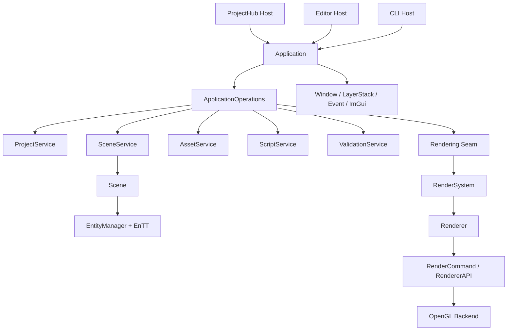
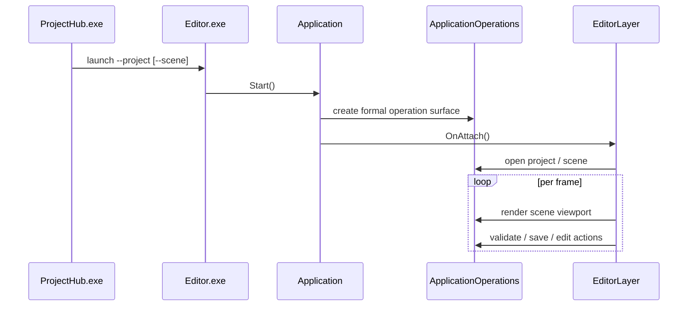

# Refactored Engine Architecture

## 1. One-Line Model

The current HuaEngine architecture is:

`hosts stay thin, formal capabilities are exposed through ApplicationOperations, and Project / Scene / Asset / Script / Validation services sit underneath as the shared engine control layer.`

## 2. Maintained Hosts

- `ProjectHub.exe`: launcher-only no-project entry
- `Editor.exe`: project-bound GUI workbench
- `HuaEngineCLI.exe`: CLI interface

`Sandbox` has been removed from the active host topology.

## 3. Layering

- Host layer: ProjectHub, Editor, CLI
- Control layer: Application, ApplicationOperations, OperationRegistry, ResultEnvelope
- Domain layer: ProjectService, SceneService, AssetService, ScriptService, ValidationService
- Engine core layer: ECS, Scene, Serialization, Reflection, Rendering, OpenGL backend, Window/Event/ImGui

## 4. Static Architecture

## 5. GUI Sequence

## 6. Reading Order

Start here when navigating changes:

1. identify the host
2. check whether the issue belongs to `ApplicationOperations`
3. then drill into scene/rendering/serialization internals
